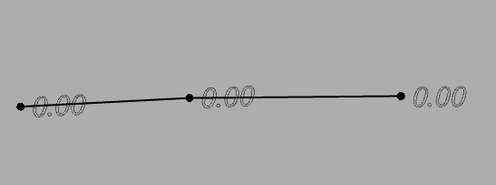
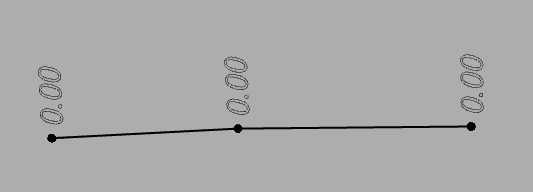

# Развернуть по линейному объекту

Данная функция позволяет поворачивать точечные объекты (условные знаки, подписи точек) по выбранному линейному объекту (полилиния, структурная линия, трасса и т.п.).

Для этого:

1. Выберите меню **Поверхность – Точки - Развернуть по линейному объекту**, курсор примет форму прицела.
2. Укажите точку (или группу точек), которую необходимо повернуть, затем укажите **Относительный угол** и далее выберите **Линейный объект**.

   

   В случае необходимости поворота сразу нескольких точек, их можно выбрать предварительно, любым доступным способом (например, командой **Выделить образующие точки**), а затем выбрать данную функцию.

   

В результате точечные объекты повернутся на указанный угол относительно выбранного линейного объекта.

Ниже представлены примеры подписей точек относительно линейного объекта.

Подписи точек вдоль линейного объекта (относительный угол 0°):

Подписи точек перпендикулярно линейному объекту (относительный угол 90°):

