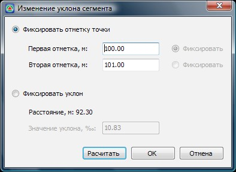

# Изменить уклон сегмента

Эта функция позволяет назначать необходимые отметки узлообразующим точкам структурной линии, так чтобы между ними был выдержан требуемый уклон. Данный механизм может быть удобен при проектировании водоотвода на площадных объектах (дворы, стоянки и т.п.).

Для этого:

1. Выберите элемент меню **Поверхность - Структурные линии - Изменить уклон сегмента**.
2. Курсор примет форму перекрестия. Выберите левой кнопкой мыши сегмент структурной линии, который необходимо отредактировать. Откроется диалоговое окно:

   

3. Задание уклона сегмента возможно следующими способами:

  * Заданием отметок начальной и конечной точки.Для этого:

    * Установите опцию **Фиксировать отметку точки**.
    * В полях **Первая отметка, м** и **Вторая отметка, м** введите необходимые значения высот.
    * Для того, чтобы оценить полученное значение уклона, нажмите кнопку **Рассчитать**, оно будет отображено в поле **Значение уклона**.
    * Нажмите **Ок**.

  * Заданием уклона относительно предварительно зафиксированной точки (начальной или конечной). Для этого:
    * Установите опцию **Фиксировать уклон**.
    * Напротив поля **Первая отметка, м** или **Вторая отметка, м** установите опцию **Фиксировать**.
    * Задайте необходимое значение уклона относительно зафиксированной точки.
    * Нажмите **Ок**.

В результате сегменту структурной линии будет присвоен требуемый уклон и пересчитаны отметки в его узлах.
