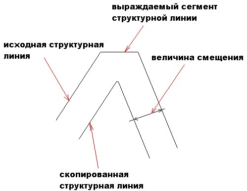

# Копировать по дистанции

Функция позволяет создавать подобие структурной линии на заданном расстоянии и превышении. При этом вместе с линией копируются принадлежащие ей узловые точки. Свойства скопированной линии совпадают со свойствами исходной.

Для того, чтобы скопировать структурную линию по заданной дистанции:

1. Выберите элемент меню **Поверхность – Структурные линии – Копировать по дистанции**. Курсор примет форму прицела.

2. Укажите левой кнопкой мыши структурную линию и направление для ее копирования.

3. В строке динамического ввода задайте необходимую дистанцию.

4. Задайте при необходимости превышение структурной линии над исходной.

   

   1. Вместо превышения можно задать значение уклона. В этом случае необходимое превышение будет автоматически вычисляться по известным значениям заложения и уклона. Для этого, щелкните на этапе ввода правой кнопкой мыши и из появившегося контекстного меню выберите пункт уклон.
   2. При копировании структурной линии по дистанции, на участках с большой кривизной, может происходить изменение геометрии структурной линии (растяжение или сжатие). В случае сжатия, некоторые ее сегменты могут вырождаться.

   

   
 
 5. Для выхода из этого режима нажмите правую кнопку мыши.
