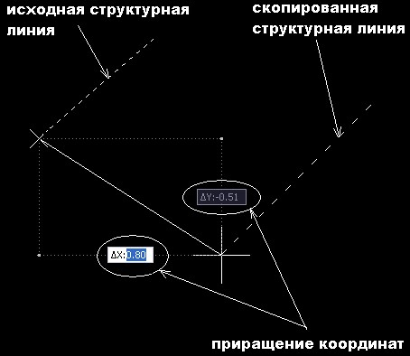

# Копировать с приращением координат

Функция позволяет копировать структурную линию по относительным координатам (X,Y,Z). При этом вместе с линией копируются принадлежащие ей узловые точки. Свойства скопированной линии совпадают со свойствами исходной.

Для этого выполните следующие действия:

1. Выберите элемент меню **Поверхность – Структурные линии – Копировать с приращением координат**. Курсор примет форму прицела.
2. Укажите левой кнопкой мыши структурную линию, которую необходимо скопировать.
3. В строке динамического ввода задайте необходимое приращение северной и восточной координаты, а так же приращение отметки и нажмите **ОК**.
   
   
   
4. Для выхода из этого режима нажмите правую кнопку мыши
