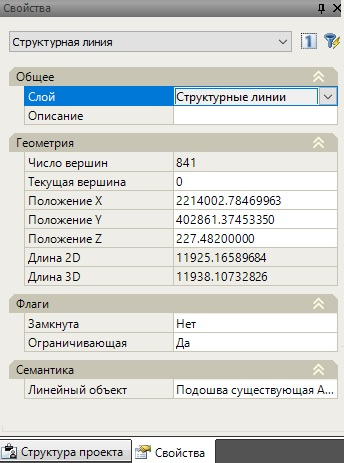
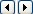

# Свойства

Параметры структурной линии, аналогично другим элементам проекта можно модифицировать непосредственно из диалогового окна **Свойства**:

Часть полей данного окна доступны для редактирования, а часть носит исключительно информационный характер.

**Описание** - в данном поле можно оставлять собственные комментарии, относительно выбранного объекта. Оно не является обязательным для заполнения.

**Число вершин** – в этом информационном поле указывается общие число узлов текущей структурной линии.

**Текущая вершина** - в данном поле показывается номер текущего узла. Т.е., это та вершина, параметры которой можно редактировать из диалогового окна Свойства. На плане данный узел обозначен перекрестием. Для того, чтобы сделать текущей следующую или предыдущую вершину воспользуйтесь пиктограммами  данного поля.

**Северная координата, м** - в этом поле можно задать значение геодезической координаты Х, для текущей вершины.

**Восточная координата, м**- в этом поле можно задать значение геодезической координаты Y, для текущей вершины.

**Длина 2D,м** – в этом информационном поле указывается длина структурной линии, полученная при проецировании ее на горизонтальную плоскость.

**Длина 3D,м**- в этом информационном поле указывается длина трехмерной структурной линии, т.е. с учетом отметок ее узлов.

**Ограничивающая** - Флаг **Да** необходимо установить, если вводимая структурная линия должна учитываться при триангуляции поверхности. Если вводимая структурная линия является исключительно ситуационным контуром данный флаг необходимо снять. Более подробно о назначении **Ограничивающих** и **Неограничивающих** структурных линий было описано выше.

**Замкнутая** - При установлении флага Да из нее будет автоматически образован замкнутый контур путем соединения начальной и конечной точки.

**Семантический код** - в данном поле, структурной линии можно присвоить необходимый семантический код. В зависимости от семантического кода и других дополнительных свойств, она может отрисовываться соответствующим цветом или линейным условным знаком. Более подробно процедура назначения условных обозначений будет описана ниже, в разделе [Оформление топографического плана.](../../planchet/topographic_plan/enter_linear_conditional_signs.md)

**Название семантической группы** - Данное поле является информационным, в нем дается описание выбранного семантического кода.
