# Ввод

Структурные линии могут вводиться по существующим точкам поверхности или произвольно с последующим автоматическим добавлением дополнительных точек в ее узлы. Если структурная линия вводится без привязки к съемочным точкам, то отметки ее узлов принимаются по текущей поверхности.



1. При отсутствии поверхности под вводимой структурной линией ее отметки принимают нулевые значения. При вставке в структурную линию дополнительных узлов, их отметки интерполируются между отметками соседних узлов.

2. Эти автоматически добавленные точки будут иметь флаг **Дополнительная**. Если построенная структурная линия не является ограничивающей, то точки будут также иметь флаг **Ситуационная**.





## {#ruchnoj-vvod}

Для того, чтобы ввести структурную линию:

1. Выберите элемент меню **Поверхность – Структурные линии – Ввести**. На экране появится графический курсор.

2. При подведении курсора к съемочной точке, автоматически срабатывает привязка (рядом с курсором загорается зеленая галочка). Щелкните по необходимой точке левой кнопкой мыши, к ней будет привязан узел структурной линии. Последовательно укажите остальные точки.

3. Для выхода из процесса ввода щелкните правой кнопкой мыши, появится следующее контекстное меню:

   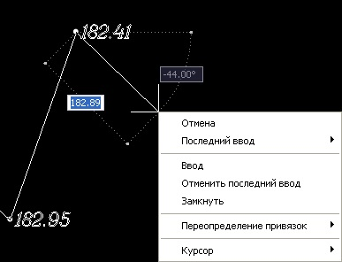

  * Выберите пункт **Ввод** для подтверждения ввода структурной линии и продолжения работы в данном режиме.
  * Выберите пункт меню **Отмена** для выхода из режима ввода структурной линии.
  * **Отменить последний ввод** позволяет отменить последний введенный сегмент структурной линии и продолжить работать в данном режиме.
  * Выберите пункт **Последний ввод**, если в процессе ввода структурной линии необходимо привязаться к какому-либо ранее введенному узлу. Список координат ранее введенных точек появится в выпадающем списке, выберите из него требуемый узел.
  * Из выпадающего списка пункта **Курсор** можно выбрать способ задания координат вводимой точки, возможны следующие варианты:

    * **Абсолютные координаты**.
    * **Пикет смещение** - положение точки задается относительно выбранного подобъекта.
    * **По расстоянию и углу**
    * **Относительное смещение**

  * Выберите пункт **Замкнуть** для того, чтобы программа соединила начало и конец структурной линии.

4. Из вышеописанного контекстного меню выберите пункт **Ввод**. Появится следующее диалоговое окно:

    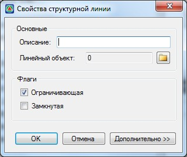
  
    В поле **Семантический код** задайте необходимое числовое значение или выберите его из стандартного кодификатора. Для того, чтобы открыть кодификатор щелкните по пиктограмме 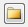, откроется окно со списком основных кодов.
  
    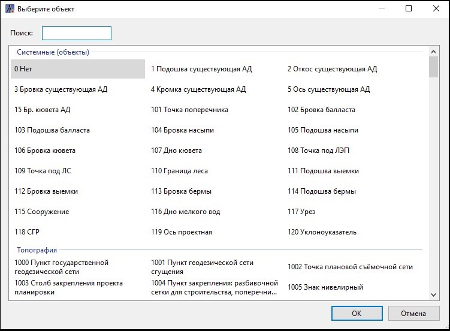
  
    Выберите необходимый код и нажмите **Ок**.

    Семантические коды структурных линий могут использоваться для разных целей:

  * В зависимости от заданного кода структурная линия может отрисовываться своим условным обозначением на плане, профиле и поперечниках (заборы, коммуникации и т.п.).
  * Код структурных линий может в дальнейшим быть использован при создании профилей и сечений. Например: если при формировании поперечников необходимо отразить на них существующие кромки, но ЦММ представляет набор треугольников без семантики, достаточно по точкам принадлежащим кромкам провести структурную линию и задать ей соответствующий семантический код.

    Флаг **Ограничивающая** необходимо установить, если вводимая структурная линия должна учитываться при триангуляции поверхности. Если вводимая структурная линия является исключительно ситуационным контуром данный флаг необходимо снять. Более подробно о назначении **Ограничивающих** и **Неограничивающих** структурных линий было описано выше.

    Если структурная линия не является замкнутой, то при установлении флага **Замкнутая** из нее будет автоматически образован замкнутый контур путем соединения начальной и конечной точки.

5. Установите необходимые опции в окне **Свойства структурной** линии и нажмите **Ок**.

Введенная структурная линия отобразится в рабочем окне.



 Помимо ручного ввода структурных линий по съемочным точкам, их также можно строить автоматизировано. Основные способы:

* [Создание структурной линии из примитива](enter_structural_lines.md#sozdat-iz-primitiva)
* [По подсвеченным точкам](enter_structural_lines.md#po-podsvechennym-tochkam)
* [Вдоль заданного направления](enter_structural_lines.md#vdol-linii)







## {#vdol-linii}

Данная функция позволяет автоматически создавать структурную линию, по точкам с определенным семантическим кодом, которые попадают в ширину коридора, откладываемого от заданного направления:

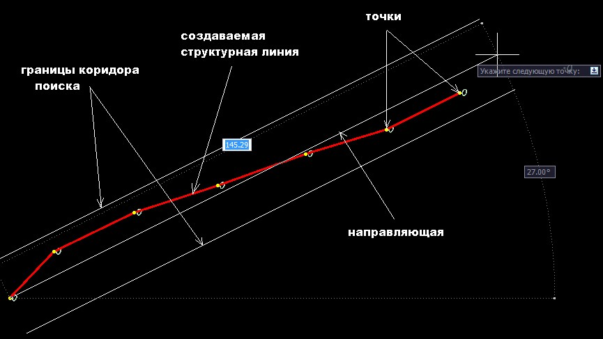

Для этого:

1. Воспользуйтесь элементом меню **Поверхность - Структурные линии - Вдоль линии**.

2. В поле динамического ввода укажите семантический код точек, по которому будет создаваться структурная линия.

3. Укажите точку начала направления поиска (она не обязательно должна совпадать со съемочной точкой), щелкнув по ней левой кнопкой мыши.

4. Перемещайте курсор вдоль заданного направления, при этом, по точкам, попадающим в коридор выбора, будет динамически создаваться структурная линия. Удерживая **Ctrl** и одновременно вращая колесо мыши можно регулировать ширину коридора поиска.

5. Последовательно левой кнопкой мыши укажите дополнительные точки, если направляющая изменяет направление. Для выхода из данного режима нажмите правую кнопку мыши, появится следующие контекстное меню:

   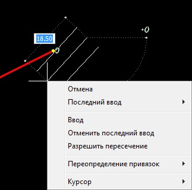

* Выберите пункт меню **Отмена** для выхода из режима ввода.
* **Отменить последний ввод** позволяет отменить последний введенный сегмент направляющей линии и продолжить работать в данном режиме.
* Если установлена опция **Разрешить пересечение**, то вводимая структурная линия может в процессе ее построения пересекать другие имеющиеся структурные линии (см. Рис.1). И наоборот, опция **Запретить пересечение** накладывает ограничение на ее построение (см. Рис.2). Данная функция может быть удобна для соединения в линию точек с одинаковым кодом, но расположенных по разные стороны от оси или другого разделяющего контура в виде структурной линии:

   | Пересечение разрешено:                                         | Пересечение запрещено:  |
   | -----------                                                    | ----------              |
   | 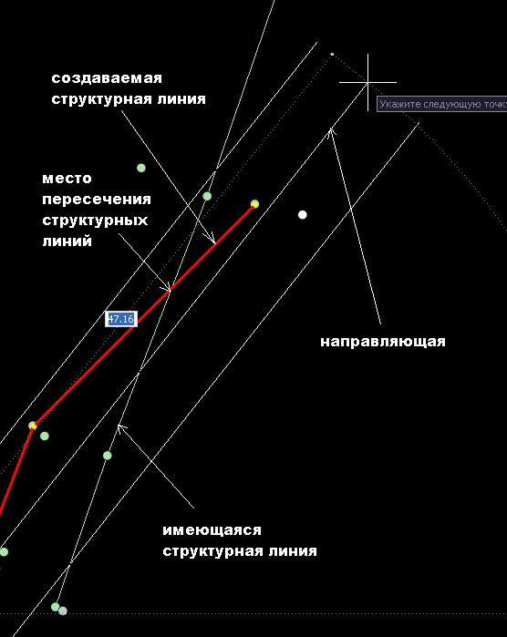 | 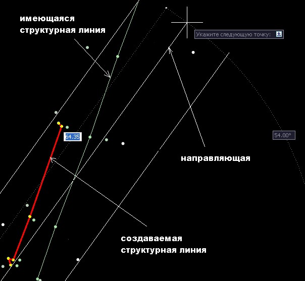 |

  * Выберите пункт **Последний ввод**, если в процессе ввода направляющей линии необходимо привязаться к какому-либо ранее введенному узлу. Список координат ранее введенных точек появится в выпадающем списке, выберите из него требуемые значения.
  * Из выпадающего списка пункта **Курсор** можно выбрать способ задания координат вводимой точки.

6. Из вышеописанного контекстного меню выберите пункт **Ввод**. Появится диалоговое окно **Свойства** структурной линии:

   

7. Задайте в данном окне необходимые опции и нажмите **Ок**.





## По высоте {#po-vysote}

Данная функция позволяет ввести структурную линию с заданной высотой, т.е. все узлы структурной линии будут иметь заданную отметку Z. Это удобно, например, при построении поверхности по растровой подложке.

Для этого:

1. Выберите меню **Поверхность – Структурные линии – По высоте**, далее в строке динамического ввода введите отметку узлов структурной линии, для подтверждения команды нажмите правой кнопкой мыши.

2. С помощью левой кнопки мыши укажите первую точку структурной линии, а затем остальные точки структурной линии.

3. Для завершения ввода нажмите **ENTER** или щелкните правой кнопкой мыши и из представленного контекстного меню выберите **Ввод**, следом появится диалоговое окно **Свойства структурной линии**:

   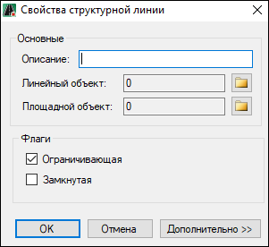

   

   Подробное описание работы с данным окном представлено в разделе [Ручной ввод.](enter_structural_lines.md#ruchnoj-vvod)

   

4. Задайте в данном окне необходимые опции и нажмите **Ок.**

В результате, структурная линия примет заданное высотное положение и отобразится в рабочем окне.





## {#po-podsvechennym-tochkam}

Данная функция позволяет автоматически создавать структурную линию по предварительно выбранным или подсвеченным точкам:

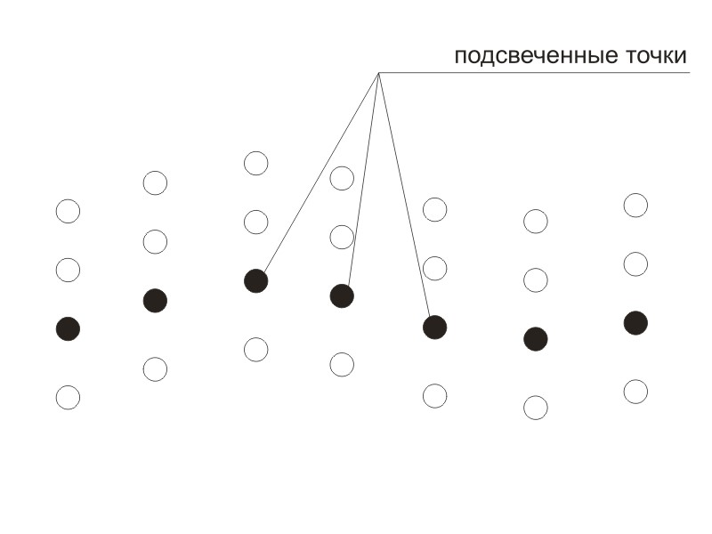



Способы [выделения точек](../points/filtering_dots.md) или их [подсветка](../points/backlight_dots.md) описывались в разделе редактирование точек.



Для ввода структурной линии по подсвеченным точкам:

1. Выберите элемент меню **Поверхность - Структурные линии – Соединить подсвеченные**, курсор примет форму прицела.
2. Секущей рамкой выделите область точек, в которой должна быть создана структурная линия. Все выделенные точки, попавшие в указанную область, будут объединены в линию. Если вместо указания точек рамкой, щелкнуть правой кнопкой мыши, в структурную линию будут включены все подсвеченные точки.

Структурная линия по умолчанию будет иметь свойство **Ограничивающая** и семантический код, совпадающий с кодом точек по которым она создавалась.





## {#po-raznye-storony-ot-osi}

Эта функция может быть полезна, когда точки с одинаковыми семантическими кодами расположены по разные стороны от какой либо структурной линии. Например, левая и правая кромки существующей дороги имеют одинаковый семантический код (4) и расположены по разные стороны от оси (код 5):

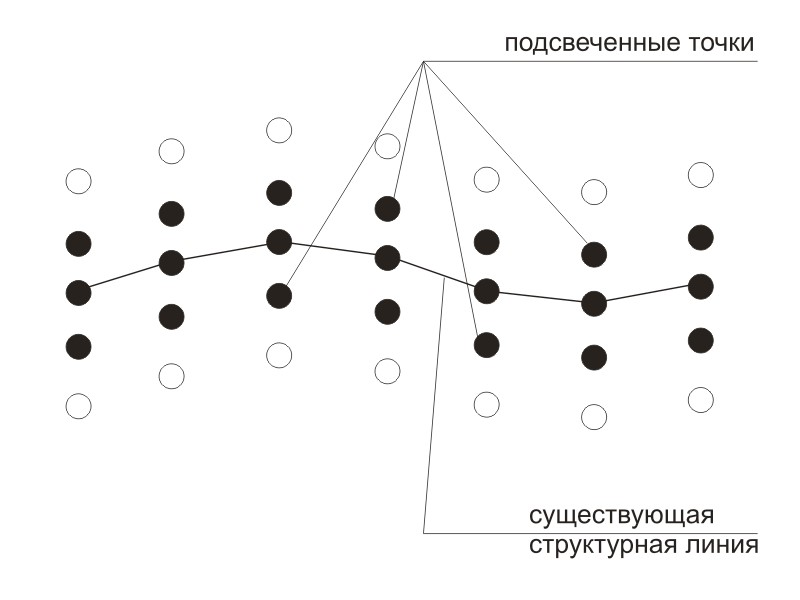



Структурные линии создаются по предварительно [подсвеченным точкам.](../points/backlight_dots.md)



Способы выделения точек или их подсветка описывались в разделе редактирование точек.

Для создания структурных линий по разные стороны от оси:

1. Выберите элемент меню **Поверхность – Структурные линии – Соединить по разные стороны от оси**. Курсор примет форму прицела.

   

   Если точки не были предварительно [выбраны](../points/filtering_dots.md) или [подсвечены](../points/backlight_dots.md), автоматически откроется окно. Выберите семантический код, из списка точек необходимо выбрать те, по которым будет создаваться структурные линии.

   

2. Курсор примет форму прицела, укажите базовую структурную линию, которая будет являться разделителем.

3. Рамкой обведите ту область точек, в которой должны быть созданы структурные линии. Все выделенные точки, попавшие в указанную область, будут объединены в линии. Если вместо указания точек рамкой щелкнуть правой кнопкой мыши, в структурную линию будут включены все подсвеченные точки.

Структурные линии по умолчанию будет иметь свойство **Ограничивающая** и семантический код, совпадающий с кодом точек, по которым они создавались.





## {#sozdat-iz-primitiva}

Структурная линия может вводиться не только по точкам поверхности, но и назначаться из примитивов чертежа (полилиний, дуг, и т.п.). Например: если в качестве исходных данных для построения поверхности имеются **3d-полилинии** (горизонтали), то на их основе легко создать структурные линии, которые в свою очередь будут использованы для создания ЦММ.

Для того, чтобы создать структурную линию из примитива:

1. Выберите элемент меню **Поверхность - Структурные линии - Создать из примитива**, курсор примет форму прицела.
2. Укажите исходный примитив, щелкнув по нему левой кнопкой мыши.
3. При необходимости проецирования структурной линии на поверхность выберите соответствующий пункт:

   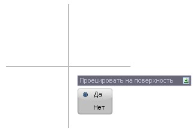

4. В появившемся окне **Свойства** структурной линии задайте ее необходимые параметры и нажмите **Ок**.



1. В узлах структурной линии будут автоматически созданы точки. Они будут иметь флаг **Дополнительная**. Если построенная структурная линия не является ограничивающей, то точки будут также иметь флаг **Ситуационная**.
2. Отметки узлообразующих точек принимаются равными отметкам вершин исходной полилинии, если вершины имели высоту отличную от нуля.







## {#soedinit-po-nomeram}

Данная функция позволяет автоматически соединить точки с последовательной нумерацией структурной линией. Это удобно, когда например, характерные линии (ось, кромки и т.п.) снимались последовательно.

Для этого:

1. Выберите меню **Поверхность – Структурные линии – Соединить по номерам**.

2. Введите начальный номер точки и нажмите правой кнопкой мыши, затем введите последний номер точки и нажмите правой кнопкой мыши или **ENTER**, появится диалоговое окно **Свойства структурной линии**:

   

   

   Подробное описание работы с данным окном представлено в разделе [Ручной ввод.](enter_structural_lines.md#ruchnoj-vvod)

   

3. Задайте в данном окне необходимые опции и нажмите **Ок**.

В результате точки по порядку соединятся структурной линией.



Вид рабочего окна спозиционируется на построенную структурную линию.




