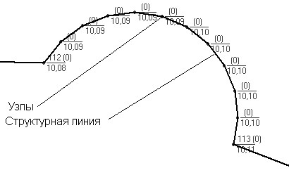

# Вставить дугу

Данная функция также позволяет вставлять в структурную линию новые узлы, путем добавления дополнительных точек, однако в этом случае новые точки добавляются не произвольно, а по дуге заданной формы.

Для одновременной вставки нескольких точек по дуге:

1. Выберите элемент меню **Поверхность – Структурные линии – Вставить дугу**.
2. Укажите в динамической строке число вставляемых точек на данном сегменте.
3. Укажите левой кнопкой мыши сегмент структурной линии, в котором необходимо вставить узлы.
4. Укажите с помощью курсора желаемую форму кривой, на которой будут размещены вставляемые точки.

Программа автоматически вставит на кривую необходимое количество узлов.



 Автоматически добавленные точки в узлах по умолчанию будут иметь флаг **Дополнительные**. Флаг **Ситуационная** будет также установлен, если исходная структурная линия не является ограничивающей. Отметки добавленных точек будут интерполироваться между соседними узлами по длине.


