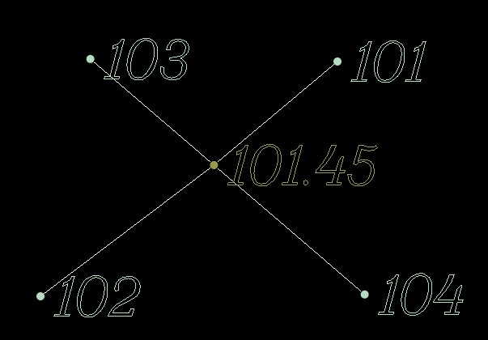
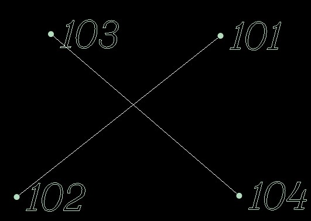

# Понятие

**Структурные линии** – это объекты - контура, обладающие определенными семантическими свойствами.

Они разделяются на две основные группы: **Ограничивающие** и **Не ограничивающие**.

Ограничивающие структурные линии вводятся, как правило, по съемочным точкам, при этом, каждый отрезок структурной линии при формировании цифровой модели рельефа обязательно будет являться ребром треугольника. Т.е. этот тип структурных линий позволяет однозначно определить характерные формы рельефа при построении поверхности, такие как ось, кромки, бордюры, бровки, подошвы насыпи, овраги, урезы рек и т. д.

Линии данного типа могут пересекаться между собой только в общей съемочной точке. В противном случае (при пересечении структурных линий в разных уровнях), отсутствует однозначное решение по построению **ЦММ**.

| Корректное пересечение:                     | Не корректное пересечение: |
| -----------                                 | -----------                |
| |       |

Не ограничивающие структурные линии являются примитивами ситуации и не влияют на расположение ребер поверхности. Вводятся они, как правило, по рельефным или ситуационным точкам. На основе ситуационных структурных линий удобно создавать различные элементы топографического плана, например: коммуникации, площадные объекты и т.д.
