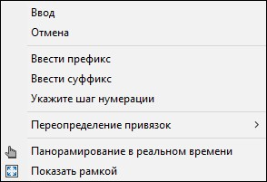

# Нумерация узлов

Данная функция позволяет выполнять нумерацию точек (точечных объектов) узлов структурной линии.

Для этого:

1. Выберите меню **Поверхность – Структурные линии – Утилиты – Нумерация узлов**, курсор примет форму прицела.

2. Выберите необходимую структурную линию и укажите участок применения функции.

   

   При необходимости выбора всей структурной линии, нажмите правой кнопкой мыши и из контекстного меню выберите соответствующую опцию.

   

3. В строке динамического ввода укажите, с какой цифры начать нумерацию точек.

   

   При необходимости дополнительных настроек нажмите правой кнопкой мыши, откроется контекстное меню:

   

* **Ввести префикс** – опция, предназначенная для ввода цифр или буквенных значений перед номером точки. Например, чтобы существующие точки сохраняли старые номера, а новые нумеровались с префиксом "н" (например, н10, н11, н12 и т.п.).
* **Ввести суффикс** – опция, предназначенная для ввода цифр или буквенных значений после номера точки. Например, новые точки можно нумеровать с суффиксом "н" (например, 1н, 2н, 3н и т.п.).
* **Укажите шаг нумерации** – данная опция означает интервал нумерации точек, например, если шаг нумерации ввести 2 и нумерацию точек начать с 1, то точки будут иметь номера: 1, 3, 5, 7 и т.п.

   

4. Задайте необходимые параметры и нажмите **ENTER**.

После проделанных действий программа произведёт нумерацию узлов структурной линии.
