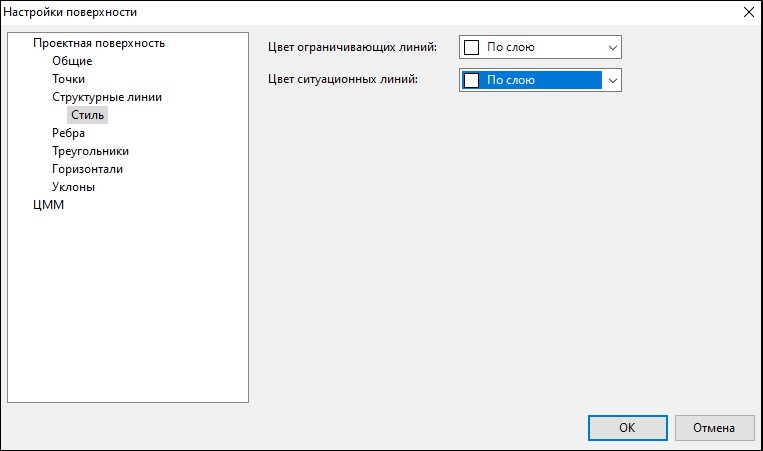
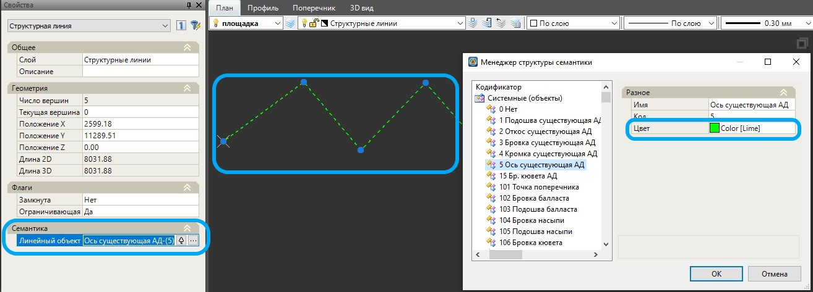

# Настройки

Данная функция используется для настройки параметров отображения структурных линий.

В диалоговом окне в пункте **Структурные линии** раскройте дерево объектов до элемента – **Стиль**:

Из выпадающих списков можно выбрать **Цвет ограничивающих** структурных линий и **Цвет ситуационных** структурных линий.

Варианты задания цветов:

* **По слою** – выбрав данную настройку, структурным линиям будет присваиваться цвет согласно настройкам слоя.
* **По блоку** – выбрав данную настройку, структурным линиям будет присваиваться цвет назначенного семантического объекта в **Менеджере структуры семантики**:

  

   

   Подробное описание работы с семантическими объектами представлено в разделе **Менеджер структуры семантики (Объектный кодификатор)**.

   

* **Путем присвоения цвета** – выбор цвета структурной линии из представленной палитры цветов.
