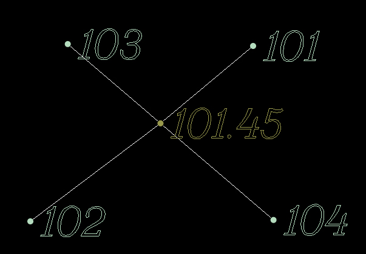
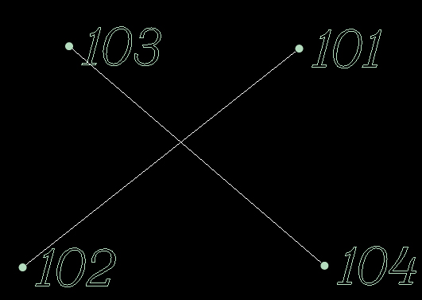

# Тестировать

Как было описано выше, ограничивающие структурные линии не должны пересекаться между собой вне съемочной точки. Если в процессе ввода структурной линии она пересекает другую, то в месте их пересечения автоматически будет добавлена дополнительная точка. Эта точка будет принадлежать обеим структурным линиям, отметка ее будет приниматься по той линии которая была введена первой.

Однако, в процессе редактирования поверхности, эта связующая точка может быть случайно удалена, что станет причиной не корректного построения триангуляции.

Для того, чтобы протестировать структурные линии на правильность их пересечения между собой:

Выберите элемент меню **Поверхность - Структурные линии - Тестировать**.

Программа проанализирует все пересечения и в случае обнаружения не корректных линий, добавит в них дополнительные съемочные точки.

| Корректное пересечение:                          | Не корректное пересечение:  |
| -----------                                      | -----------                 |
|     |        |
