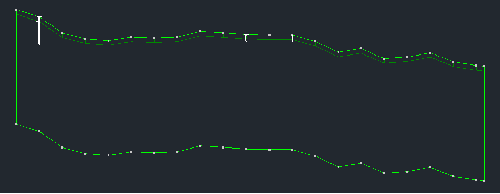
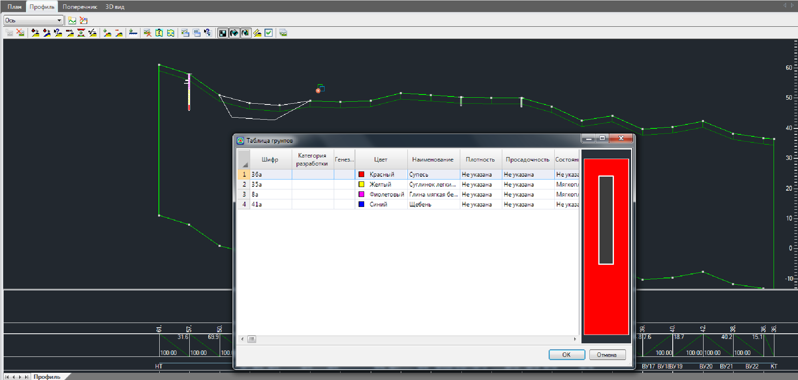
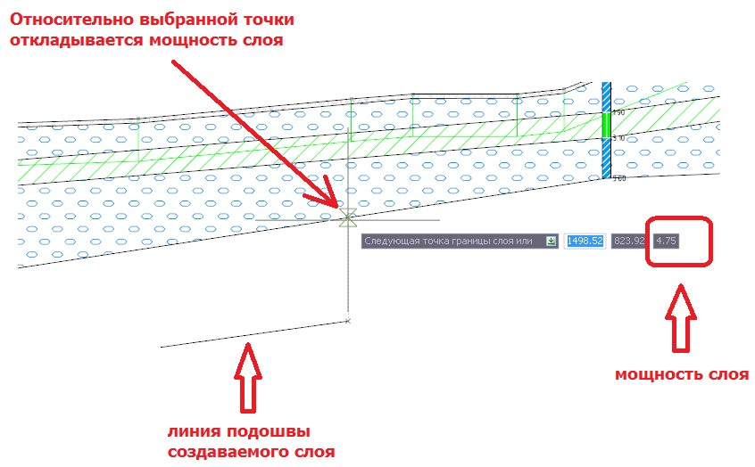

# Нанесение геологических слоев на продольный профиль

Перед первичным нанесением геологических слоев на продольный профиль необходимо создать **Базовый геологический контур**, в пределах которого они будут размещены. Т.е., контура геологических слоев могут образовывать вложенную иерархию, где один контур может содержать в себе набор других контуров. Базовый контур представляет собой верхний уровень данной иерархии.

Для этого, выберите элемент меню **Задачи - Геология - Создать секцию геологии по земле** или нажмите кнопку  на панели **Геология**. В результате, будет создан замкнутый контур, верхняя граница которого совпадает с черным профилем, а правая находиться ниже его (по умолчанию на глубине в 50м.).

Для того что бы удалить базовый геологический контур со всеми вложенными геологическими слоями воспользуйтесь меню **Задачи - Геология - Удалить секцию геологии**.

Если же требуется удалить все вложенные слои, а положение ограничивающего контура оставить неизменным, воспользуйтесь меню **Задачи - Геология - Очистить секцию геологии**.

Для ввода геологического слоя:

1. Выберите элемент меню **Задачи - Геология - Добавить контур слоя**. Курсор примет форму прицела.

2. Левой кнопкой мыши укажите вершины образующие вводимый слой. При вводе можно привязываться к контурам предварительно введенных слоев, базовому геологическому слою или линии черного профиля. При этом, если на этапе задания вершин будет образован замкнутый контур, то процесс его ввода автоматически прекратится и откроется окно **Таблица грунтов**:

   

   

   Для ввода геологического слоя необходимой мощности, в режиме ввода нового слоя нажмите клавишу **Tab** ,два раза, до перехода в третью строку динамического ввода, задайте необходимое значение мощности слоя, в результате относительно указанных точек (положение курсора) будет строиться линия подошвы геологического слоя:

   

   

3. Выберите грунт, который должен соответствовать вводимому контуру, дважды щелкнув по соответствующей строке левой кнопкой мыши.

В результате, контур грунта будет создан и с соответствующей ему штриховкой отобразится на продольном профиле.

При вводе контура геологического слоя программа контролирует соблюдение следующих условий:

* Слои вводятся исключительно внутри базового геологического контура.
* Контур слоя должен быть замкнутым. Замкнутые контуры могут создаваться автоматически, если их начальная и конечная точка привязана к линии черного профиля или предварительно введенным геологическим слоям. Для того чтобы самостоятельно замкнуть контур слоя на этапе его ввода необходимо щелкнуть правой кнопкой мыши и выбрать из появившегося контекстного меню пункт **Замкнуть**.
* Контур вводимого слоя может быть вложенным в другие, уже предварительно отрисованные геологические слои, но не может их пересекать. Также контур не должен иметь самопересечений.
* Программа автоматически контролирует условие не пересекаемости контуров на этапе их ввода и не дает ввести вершину контура, если он будет пересекать существующие. Также это условие соблюдается на этапе редактирования, т.е. при перемещении вершин уже созданного контура.

При нанесении, геологических слоев программа контролирует выше указанные условия. При необходимости дополнительной проверки совпадения верхней границы базового контура с линией черной земли на профилях и поперечниках, можно воспользоваться окном **Список ошибок**:

1. Для открытия окна **Список ошибок** выберите элемент меню **Задачи - Геология - Список ошибок**. По умолчанию данное будет расположено в низу, под графическим полем программы.
2. Выберите элемент меню **Задачи - Геология - Проверить геологию на профиле на наличие ошибок** или нажмите кнопку  На панели **Геология**.

В результате, будет произведена проверка, а имеющиеся ошибки описаны в окне **Список ошибок**.
