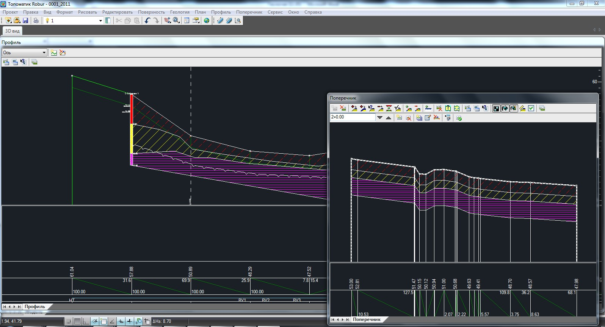
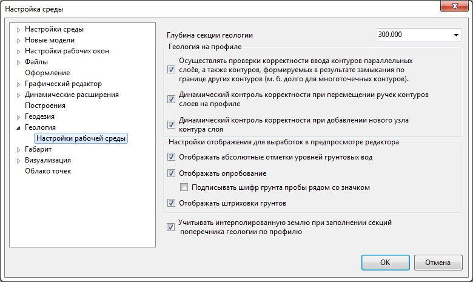
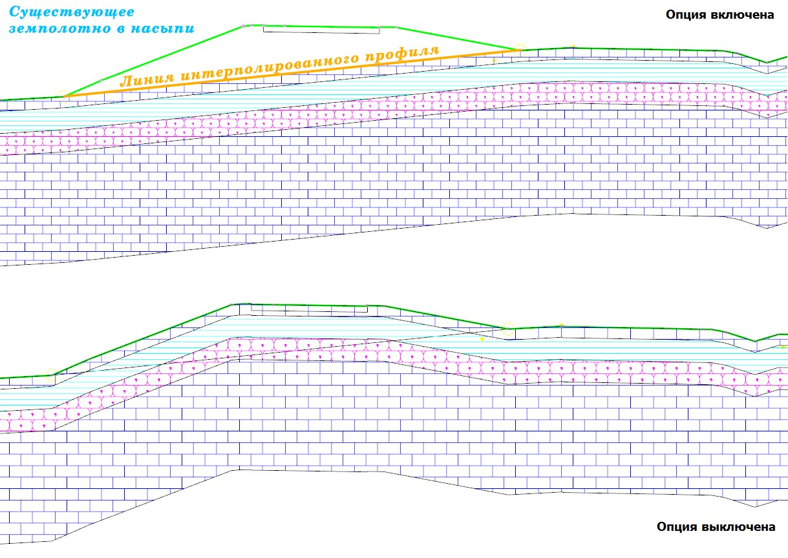
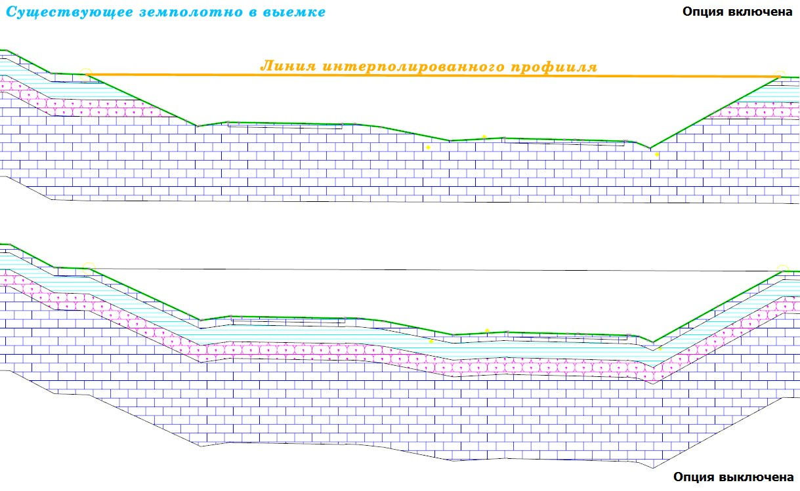

# Нанесение геологических слоев на поперечные профили

Последовательность действий по нанесению геологических слоев на поперечники, аналогична их нанесению на продольный профиль. Также, до нанесения геологии на поперечниках необходимо создать граничные контуры. Для этого воспользуйтесь элементом меню **Задачи - Геология -Создать секции геологии для всех поперечников**.

Имеется возможность автоматического формирования геологических слоев на поперечниках по данным продольного профиля. Для этого:

1. Выберите элемент меню **Задачи - Геология - Заполнить секции геологии поперечника по профилю**. Откроется окно:

   

2. Укажите пикеты границ участка, в пределах которого должна быть нанесена геология на поперечники. Если геология должна быть снесена на все поперечники текущей модели нажмите кнопку **Вся трасса**.
3. Нажмите **Ок**.

В результате, секции поперечников на выбранном участке будут заполнены. Геология сносится на поперечник параллельными слоями. Т.е. границы их контуров будут параллельны линии черной земли поперечного профиля:



 В случае, если выполняется проект реконструкции или ремонта, то автоматически сносить геологические слои с продольного на поперечные профили параллельными слоями не совсем корректно, так как присутствует существующее земляное полотно, возведенное ранее, которое необходимо учитывать. Для этого используется линия интерполированного профиля (т.е. линия земли до возведения земляного полотна существующей дороги). В результате, при снесении геологии с профиля на поперечники, геологические слои будут параллельны линии интерполированного профиля, а не линии земли.

Для этого:

1. Выберите меню **Сервис – Настройка**, в открывшемся окне перейдите на вкладку **Настройки геологии**:

   

2. Включите опцию **Учитывать интерполированную землю при заполнении секций поперечника геологии по профилю** и нажмите **ОК**.

В результате, при снесении геологических слоев будет учтена линия интерполированного профиля.

Ниже приведены примеры:



При необходимости редактирования геологии на текущем поперечном профиле используется тот же функционал, который был описанный выше, в подразделе [Редактирование контуров геологических слоев](editing_contours_geological_layers.md).

Аналогично продольному профилю, для удаления геологических слоев вместе с базовым контуром, на текущем поперечнике используется функция **Задачи - Геология - Удалить секцию геологии**. Если требуется удалить на текущем поперечнике только геологические слои, то используется функция **Задачи - Геология - Очистить секцию геологии**.

Для удаления геологических секций всех имеющихся поперечников используется функция **Задачи - Геология -Удалить секции всех поперечников**. А для очистки, соответственно, используется функция **Задачи - Геология -Очистить секции всех поперечников**.
