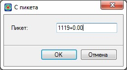

# Копирование геологии на поперечниках

Функция позволяет копировать геологический разрез с одного поперечника на другой, или группу выделенных поперечников.

Для этого:

1. Выберите необходимый поперечник (или группу поперечников), на который необходимо скопировать геологию. Выберите меню **Задачи – Геология – Копировать геологию с поперечника**, откроется диалоговое окно:

   
   
2. Введите пикет поперечника, с которого необходимо скопировать геологический разрез и нажмите **ОК**.

В результате, на текущий поперечник (или группу поперечников) будет скопирована геология.



 Так как копируемая секция геологии с другого поперечника имеет отличное очертание линии земли (черного поперечника) от текущего поперечника, то, скорее всего, потребуется дополнительные корректировки, которые могут быть автоматически исправлены функцией **Подогнать ограничивающий контур** (меню **Задачи – Геология - Подогнать ограничивающий контур**).


