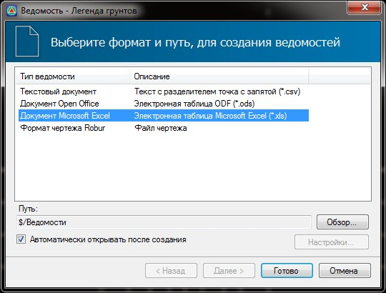
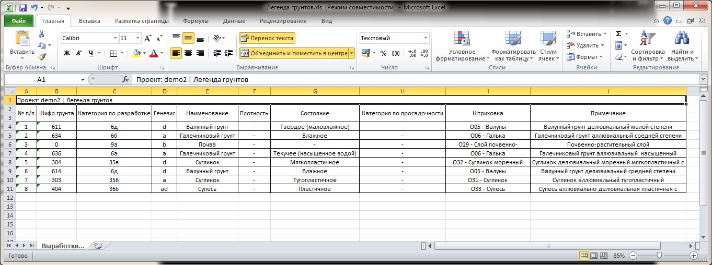

# Создание ведомостей

Программа позволяет формировать ведомости грунтов и геологических выработок.

Ведомости могут формироваться как по текущей трассе, так и по глобальной библиотеке грунтов или выработок, которые содержит проект. Для этого:

1. Проверьте, является ли текущей трасса или **ЦММ,** содержащая необходимую информацию по грунтам и выработкам, на основе которой требуется сформировать ведомости. Процесс выбора текущей модели был описан в разделе **Структура проекта**.
2. Выберите тип создаваемой ведомости с помощью элемента меню **Задачи - Геология - Создать ведомость…**.
3. В окне мастера ведомости задайте необходимые настройки ее формирования:

   

   В данном окне, в поле **Тип ведомости** можно выбрать ее формат, в зависимости от редактора, в котором она должна быть открыта. В поле **Путь** отображается адрес папки, в которую по умолчанию сохраняются все создаваемые ведомости. Его можно изменить с помощью кнопки **Обзор**. В поле **Тип ведомости** выберите необходимый ее формат.

4. Нажмите кнопку **Готово**.

В результате, выбранная ведомость будет сформирована и в зависимости от ее формата автоматически открыта в соответствующем редакторе:

