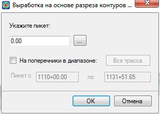

# Создание фиктивных выработок на основе геологического разреза профиля

Функция позволяет автоматически на необходимом участке создать геологическую выработку, мощности слоев которой будут взяты с геологического разреза профиля.

Для создания фиктивной выработки:

1. Выберите меню **Задачи – Геология – Выработки на основе разреза контуров слоев профиля** или кнопку  на панели окна **Профиль**, откроется диалоговое окно:

   

   В поле ввода **Укажите пикет** введите номер пикета вставки фиктивной выработки или укажите его визуально выбрав соответствующую кнопку.

   Включение опции **На поперечники в диапазоне** позволяет автоматически создать фиктивные выработки по профилю в местах поперечных профилей на выбранном пикетажном диапазоне либо всей трассе.
