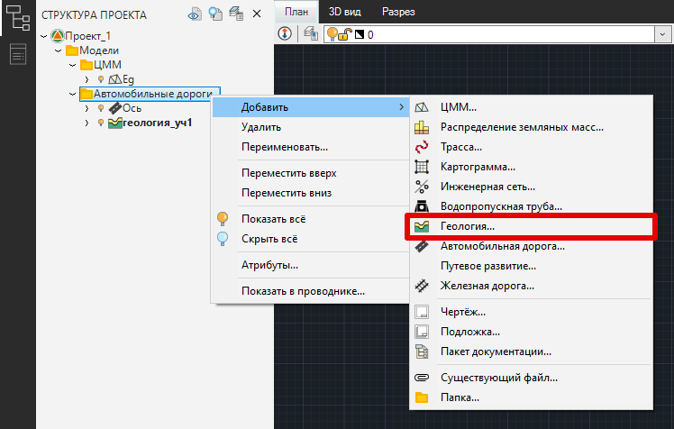
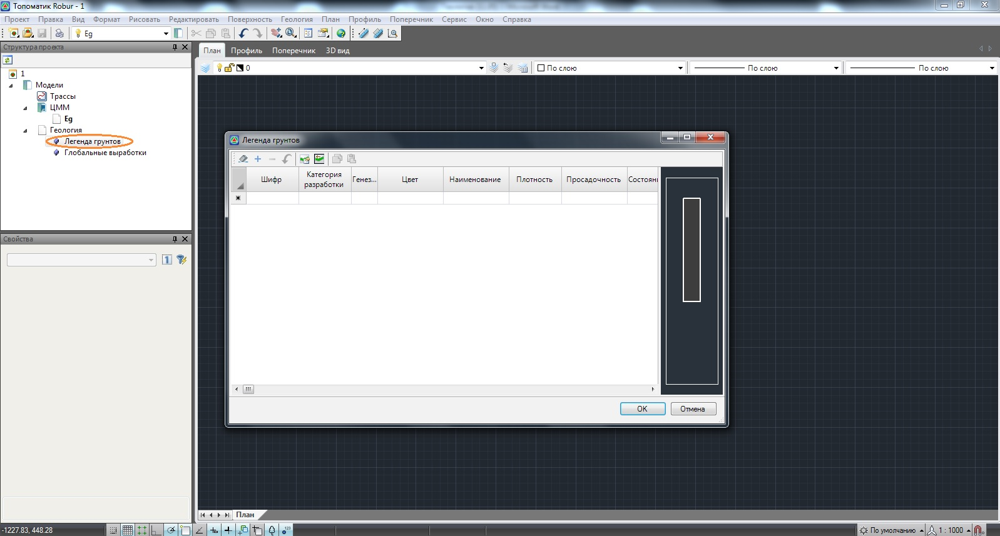
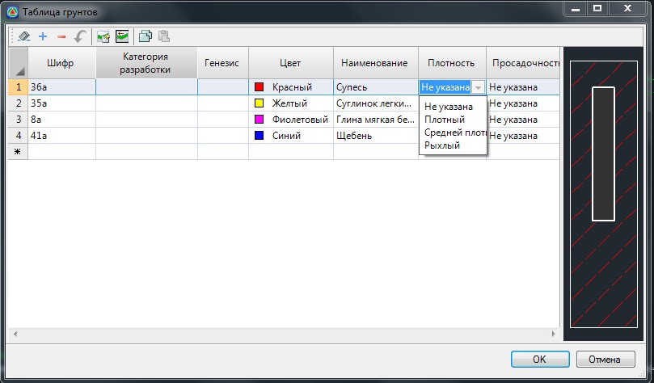
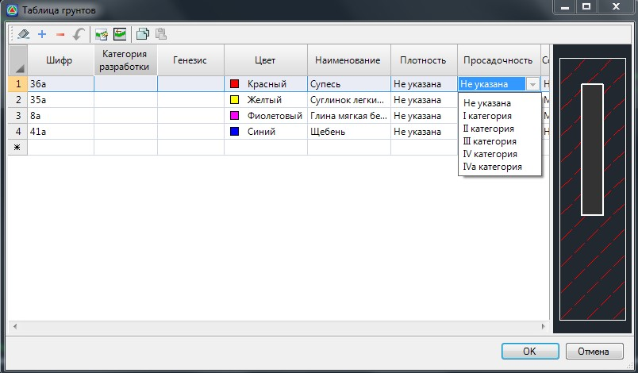
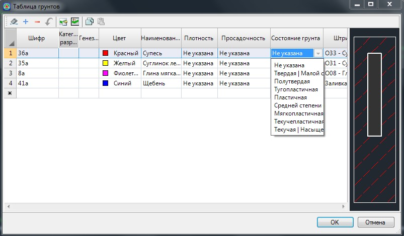
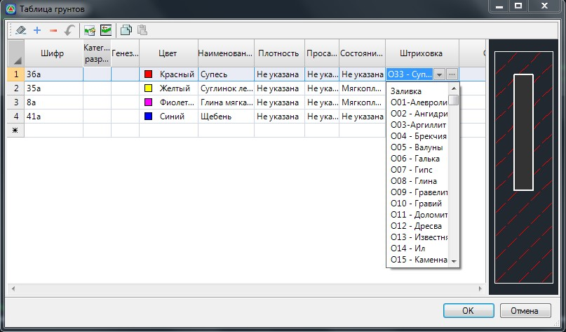
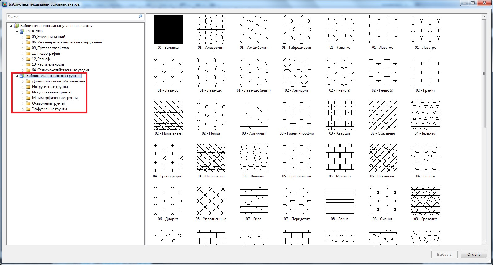
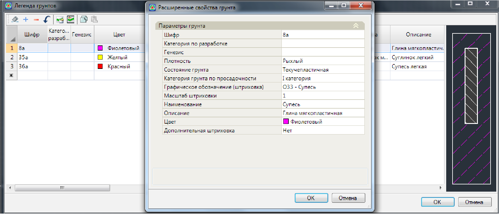
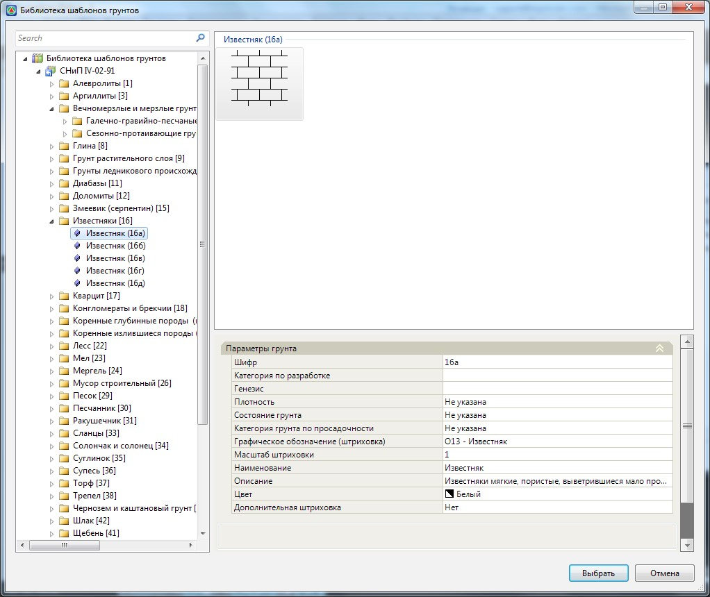

# Создание легенды грунтов

Легенда представляет собой стандартный классификатор грунтов, которые используются для формирования скважин и нанесение геологических слоев на профили и сечения. Она является исходной основой, в которой может храниться максимально полный перечень грунтов. Как правило, при создании геологической модели конкретной трассы используются не все грунты легенды, а лишь несколько из них. Эти грунты могут быть созданы в локальной библиотеке (которая относится к текущей трассе) или выбраны из глобальной библиотеки (легенды грунтов). В начале, рассмотрим последовательность действий по созданию самой легенды грунтов.

Для открытия таблицы **Легенда грунтов**:

* Выберите элемент меню **Геология - Легенда грунтов**.
* Данную таблицу также можно открыть, воспользовавшись окном **Структура проекта**. Для этого раскройте дерево модели **Геология** . В раскрывшемся списке дважды щелкните левой кнопкой мыши по элементу **Грунты**.

   

   Обратите внимание на то, чтобы в **Структуре проекта** была создана модель **Геология** . В случае, если она отсутствует, щелкните **ПКМ** по любой папке в **Структуре проекта** и из контекстного меню выберите **Добавить - Геология**:

   

   

В результате откроется соответствующая таблица:

Каждый грунт библиотеки задается в отдельной строке таблицы. Ему может соответствовать следующий набор параметров задаваемых в следующих столбцах:

* **Шифр** – представляет собой буквенно-числовое описание грунта и его основных параметров. В данном поле также может задаваться номер инженерно-геологического элемента (ИГЭ).
* **Категория грунта** – в данном поле задается группа грунта по трудности разработки.
* **Цвет** – Из выпадающего списка можно выбрать цвет, которым будет отрисовываться штриховка или заливка текущего грунта.
* **Наименование** – В данном поле вводится название грунта.
* **Плотность** – Параметр плотности может быть выбран в соответствующем поле из выпадающего списка:

  

* **Просадочность** – категория грунта по степени просадочности выбирается в соответствующем поле из выпадающего списка:

  

* **Состояние грунта** – из выпадающего списка выбирается консистенция грунта и степень его водонасыщения:

   

* **Штриховка** – в данном поле, грунту можно назначить соответствующий тип штриховки, с которой он будет отображаться на геологических разрезах, сечениях и их чертежах. Штриховку можно выбрать из выпадающего списка, в соответствии с наименованием грунта:

   
   
   Также, необходимый тип штриховки грунта можно выбрать визуально из стандартной библиотеки программы. Для этого, в поле **Штриховка** щелкните левой кнопкой мыши по пиктограмме  . Откроется библиотека площадных условных знаков:

   

   В левой части данного окна выберите группу **Библиотека штриховок грунтов**. В графическом поле выберите требуемую штриховку, дважды щелкнув по ней левой кнопкой мыши. В результате, соответствующие ей наименование грунта будет отображено в поле штриховка, а ее условное обозначение будет показано в правой части окна **Легенда грунтов**. В данном поле отображается основная штриховка слоя, которая отрисовывается внутри геологических контуров на профилях и сечениях, а также штриховка по состоянию грунта, отображаемая на геологических выработках. Тип штриховки по состоянию грунта выбирается в зависимости от его консистенции, которая задается в соответствующем поле.

   Функционал программы позволяет создавать собственные образцы штриховок, а также загружать их из файлов различных форматов.

* **Описание** - В данном поле можно давать расширенное описание наименования грунта и его основных свойств. Эта информация, в последствие, будет передаваться в таблицы выработок, выходные чертежи и ведомости.

  

  В таблице ** Легенда грунтов** задаются их основные параметры. Расширенные свойства, такие как **дополнительная штриховка, масштаб штриховок и т.п**., можно задать в специальном дополнительном окне:

  

  Для его вызова необходимо дважды щелкнуть левой кнопкой мыши по наименованию грунта. В частности, в данном окне, в поле **Дополнительная штриховка**, можно задавать грунтам, имеющим включения дополнительную штриховку.

  

В верхней части таблицы грунтов есть ряд дополнительных кнопок:

* **Очистить таблицу** - данная функция позволяет полностью удалить все грунты текущего списка.
* **Вставить строку**- над текущей строкой списка добавляется новая пустая строка.
* **Удалить строку**- удаляется текущая строка таблицы.
* **Отмена** - последовательно отменяется одно или несколько последних действий.
* **Копировать** - данная команда позволяет копировать параметры текущего грунта в буфер обмена.
* **Вставить** - данная команда позволяет вставить в пустую строку списка параметры грунта, который был предварительно скопирован в буфер обмена.
* **Добавить грунт на основе шаблона из библиотеки** - в программе имеется библиотека шаблонов грунтов, с параметрами заданными по умолчанию. При составлении легенды грунтов можно использовать грунты данной библиотеки, при необходимости модифицировав их свойства уже в самой легенде. Для вставки грунта в легенду из библиотеки:

  1. Нажмите кнопку **Добавить грунт на основе шаблона из библиотеки** . Откроется стандартная библиотека грунтов:

     

  2. В левой части окна из общего списка выберите грунт, который необходимо добавить в легенду. В графическом поле отобразится его штриховка, а основные свойства будут показаны в группе полей **Параметры грунта**.
  3. Нажмите кнопку **Выбрать**.

     В результате, выбранный грунт со всеми его свойствами будет скопирован в таблицу **Легенда грунтов**.

* **Выбрать грунты по трассе** - данная функция позволяет импортировать в общую легенду грунтов, которая применима ко всему проекту, грунты из локальных библиотек, которые относятся к определенным трассам , если изначально они создавались именно в этих таблицах. Процедура создания и редактирования локальной таблицы грунтов будет описана ниже.

  Для импорта грунтов из локальной таблицы в глобальную:

  1. Нажмите кнопку **Выбрать грунты по трассе**.
  2. В появившемся окне выберите левой кнопкой мыши из списка трассу, грунты которой необходимо импортировать в легенду и нажмите **ОК**.
  3. Откроется **Таблица грунтов** выбранной трассы. Выберите один или несколько грунтов и нажмите кнопку **ОК**.
 
  В результате выбранные грунты будут скопированы из локальной таблицы в общую легенду.
 
Для выхода из легенды грунтов нажмите кнопку **ОК**.
