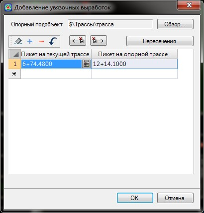

# Создание увязочных выработок

Функция позволяет создать геологические выработки на основе имеющейся геологии с другого подобъекта. Т.е. в случае когда геологические слои на определенном участке одной трассы совпадают с геологией по другой трассе. Например когда две трассы пересекаются.

Для того чтобы добавить увязочные выработки:

1. Выберите меню **Задачи - Геология - Добавить увязочные выработки**, откроется диалоговое окно:

   

   В данном диалоговом окне необходимо указать **пикет текущей трассы** (подобъект, на заданный пикет которого будет добавлена геологическая выработка) и **пикет опорной трассы** (подобъект, с указанного пикета которого будет использована геология).

   **Опорный подобъект** - нажав кнопку **Обзор**, укажите подобъект, на основе геологических слоев которого будет добавлены увязочные выработки.

   Задать значения пикетов трасс можно следующими способами:

   1\. **Автоматически**. Для этого нажмите кнопку **Пересечения**, программа автоматически определит все пересечения текущей и опорной трассы и заполнит соответствующие поля ввода.
   2\. **Указав пикеты визуально** в окне **План** с помощью кнопок .
   3\. **Ввести вручную**, в полях **Пикет на текущей трассе** и **Пикет на опорной трассе** задать необходимые пикетажные значения.

      

   Указав пикет одной из трасс, пикет второй может быть рассчитан автоматически, для этого нажмите кнопку 

    

2. Задайте необходимые данные и нажмите **Ок**. В результате на текущей трассе будут созданы геологические выработки, геологические слои которых будут соответствовать опорной трассе на заданных пикетах.
