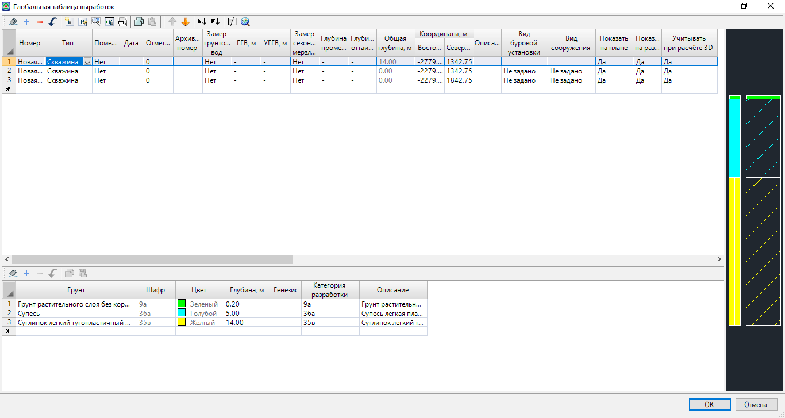

# Создание таблицы глобальных выработок

В отличие от локальной таблицы выработок, данная библиотека не относится к одной лишь заданной трассе. Здесь все выработки хранятся в координатах и при необходимости могут быть снесены на несколько трасс одновременно.



Обратите внимание на то, чтобы в **Структуре проекта** была создана модель **Геология** . В случае, если она отсутствует, щелкните **ПКМ** по любой папке в **Структуре проекта** и из контекстного меню выберите **Добавить - Геология**:



Для открытия таблицы глобальных выработок выберите элемент меню **Геология - Глобальные выработки** или в **Структуре проекта** раскройте дерево модели **Геология**  и выберите элемент **Выработки**. Откроется следующее окно:

В отличии от **локальной библиотеки**, где выработки задавались по пикетажу текущей трассы, в данной таблице выработки создаются непосредственно в координатах.



Кроме того, особенностью **Глобальной таблицы выработок** является наличие столбца **Учитывать при расчете 3D**, в котором выработкам можно указать учитывать ли их при расчете **3D-модели геологии**. Более подробно о **3D-модели геологии** см. [здесь](geology_3d_model.md).



В остальном, структура таблицы **Глобальные выработки** схожа с таблицей [Выработки](creation_table_workings.md), последовательность создания и редактирования которой была описана выше.
