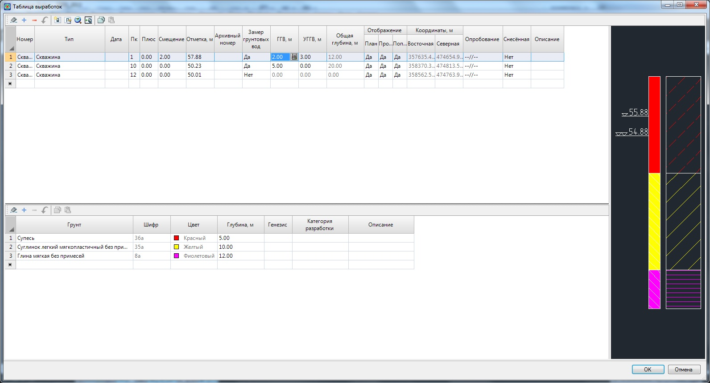
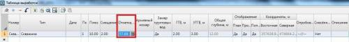
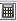
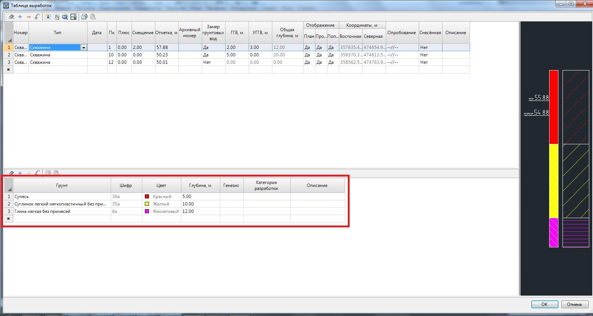
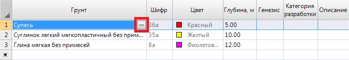

# Создание таблицы выработок

Аналогично грунтам, выработки могут храниться в двух таблицах: **глобальной** и **локальной**. **Локальные выработки** создаются преимущественно относительно текущей трассы.

**Глобальные** же выработки относятся не к конкретной трассе, а всему проекту. При этом, если проект содержит несколько трасс, то одна и та же выработка может быть снесена на каждую из них.

Также, аналогично грунтам, выработки могут импортироваться из глобальной таблицы в локальную и наоборот.

Вначале рассмотрим процедуру создания и редактирования таблицы локальных выработок.

Для этого:

1. Выберите меню **Задачи - Геология -Выработки**. Откроется следующее окно:

   

   

   Если элемент меню **Задачи - Геология -Выработки является неактивным**, то необходимо проверить является ли текущей модель группы **Трасса(Автомобильная дорога или Железная дорога)**. Если текущей является отличная модель (**ЦММ, Геология** и т.п.), то необходимо сделать текущей соответствующую модель группы **Трасса (Автомобильная дорога или Железная дорога)**. Процесс назначения/смены текущей модели подробно описан в разделе [Структура проекта](../../install_startup/startup/structure_project/structure_project.md).

   

   В верхней части диалогового окна формируется список выработок, которые содержит текущая трасса.

   При выборе какой-либо выработки из списка, в нижней части данного окна можно задать или изменить формирующие ее грунты. Текущая выработка с заданными ей параметрами (грунты, УГВ и т.п.) схематично отображается в правой части окна.

   Каждая выработка задается в отдельной строке таблицы. Ей может соответствовать следующий набор параметров назначаемых в следующих столбцах:

 * **Номер** – в данном поле задается наименование скважины. Имя скважины должно быть уникальным. Библиотека грунтов не может содержать две скважины с одинаковым названием.
 * **Тип** - выбирается из выпадающего списка. Тип выработки также влияет на ее условное обозначение на плане и профилях.
 * **Дата** - данное поле является информационным и не обязательным для заполнения.
 * **Пк, Плюс, Смещение** – в данной группе полей можно задать пикетажное положение и смещение выработки относительно текущей трассы. Если она расположена слева относительно направления пикетажа трассы, то значение ее смещения вводится с отрицательным знаком.
 * **Отметка** – в данном поле задается отметка устья выработки. Отметка может быть автоматически взята с текущего поперечного профиля (с учетом ее смещения) или продольного профиля трассы, если на данном пикете поперечник отсутствует. Для этого:

   1. Щелкните левой кнопкой мыши по полю **Отметка**:

      

   2. Нажмите левой кнопкой на появившейся пиктограмме .

   3. Если выработка задана со смещением, но на данном пикете отсутствует черный поперечник, то программа выдаст следующий запрос:

       

       Нажмите **Да** для подтверждения действия, в этом случае отметка будет автоматически рассчитана, либо **Нет** для выхода из текущий команды.

 * **Архивный номер** – в данном поле задается архивный номер выработки.
 * **Замер грунтовых вод** – если в данном поле установлен параметр **Да**, то условные обозначение горизонта грунтовых вод (ГГВ) и установившегося горизонта грунтовых вод (УГГВ) будут отображаться рядом с выработкой на профиле и поперечниках, если они были заданы в соответствующих полях. В противном случае, если установлен параметр **Нет**, данные элементы не будут отображены.
 * **ГГВ, УГГВ** – задается значение глубины уровня грунтовых вод (ГГВ) и установившегося уровня грунтовых вод (УГГВ).
 * **Общая глубина** – полная глубина выработки. Данное поле является информационным и недоступно для редактирования.
 * **Отображение** – в данной группе полей устанавливается признак отображение выработки на плане, профиле и поперечнике. По умолчанию установлен параметр **Да**.
 * **Координаты** - при задании скважине пикетажного значения и при необходимости смещения, в данном поле отображаются ее координаты. Оно является информационным и не доступно для редактирования.

2. Нажмите **Ок**.

Большинство выше указанных параметров выработки можно также задать в отдельном диалоговом окне. Для его вызова необходимо дважды щелкнуть левой кнопкой мыши по строке, в которой задаются параметры соответствующей выработки. Также оно может быть вызвано нажатием кнопки **Добавить выработку**  , если требуется создать новую выработку в списке или **Редактировать выработку**  , если необходимо модифицировать параметры существующей.

В результате, появится следующее окно:

Также, в данном окне имеется возможность задавать положение скважин графическим образом. Для этого:

1. Нажмите кнопку  расположенную рядом с поле пикет. Автоматически откроется окно **План**, а курсор примет форму прицела.
2. Левой кнопкой мыши укажите в окне **План** необходимое положение скважины.

В результате поля **Пикет, Смещения** и **Координаты** будут заполнены. Поля координаты также доступны для редактирования. При изменении значений координат выработки автоматически пересчитывается ее пикетажное значение. Для выхода из данного окна нажмите **ОК**.

Грунты текущей скважины задаются в нижней части окна:

Грунты, формирующие скважину, задаются последовательным выбором их из предварительно созданной библиотеки грунтов.



 Последовательность по созданию локальной [таблицы грунтов](creation_table_ground.md) и [легенды грунтов](creation_legend_ground.md) была описана выше.



 Для того чтобы выбрать грунт из таблицы грунтов:

1. Щелкните левой кнопкой мыши в поле **Грунт**.
2. Нажмите левой кнопкой на появившейся пиктограмме:

   

   Откроется **библиотека грунтов** соответствующая текущей трассе:

   

   Дважды щелкните левой кнопкой мыши по грунту, который должен быть присвоен выработки.

   В результате выбранный грунт со всеми соответствующими ему параметрами (шифр, цвет, штриховка и т.п.) будет снесен в список грунтов текущей выработки. Вышеуказанные параметры не доступны для редактирования, их можно изменять непосредственно в таблице **Грунты**.

   Каждому выбранному грунту, который формирует текущую выработку необходимо в соответствующем поле задать значение глубины его нижней границы. Глубина задается от устья скважины:

   

   При формировании списка грунтов у выбранной скважины, они схематично отображаются в правой части данного окна:

   

   Для выхода из таблицы грунтов нажмите **ОК**.
