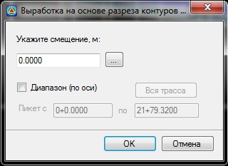

# Создание выработок на основе геологических слоев на поперечнике

Функция предназначена для автоматического создания геологических выработок с учетом имеющихся геологических контуров поперечника. Эти выработки используются для увязки продольного геологического разреза с геологическими разрезами поперечников, по умолчанию на выходных чертежах они не отображаются.

Для этого:

1. Выберите меню **Задачи - Геология - Выработка на основе разреза контуров слоев на поперечнике** или кнопку , откроется диалоговое окно:

   

 * **Укажите смещение,м** - поле ввода, для задания величины смещения выработки относительно оси трассы. Кнопка расположенная рядом с полем ввода позволяется визуально указать смещение.
 * **Диапазон (по оси)** - опция позволяет выбрать пикетажный участок, на всех поперечниках которого по оси будут созданы выработки.
2. Задайте необходимые параметры и нажмите **Ок**. Программа создаст геологические выработки.
