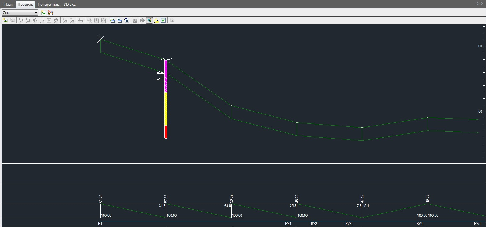
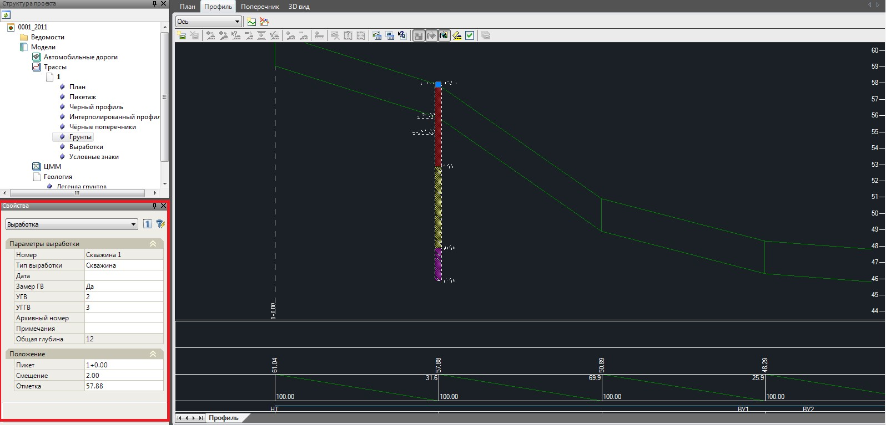

# Отображение скважин на профиле

Если библиотека выработок текущей трассы заполнена, т.е. содержит список скважин, а каждая скважина в свою очередь содержит список грунтов и прочих параметров, то эти скважины автоматически отображаются на продольном профиле и поперечниках. На поперечниках отображаются только те скважины, пикеты которых совпадают с пикетами поперечников:

Редактирование параметров выработок нанесенных на профиль может осуществляться не только через таблицу **Выработки**, но и непосредственно через диалоговое окно **Свойства** выбранного объекта:

Положение скважины можно также редактировать визуально. Для этого необходимо выбрать выработку левой кнопкой мыши и удерживая точку привязки (устье выработки), переместить ее в требуемое место.

Для того чтобы открыть для редактирования таблицу с параметрами конкретной выработки, выбранной непосредственно на продольном профиле:

1. Выберите элемент меню **Задачи - Геология -Свойства выработки**.
2. Выберите левой кнопкой мыши выработку (или группу выработок) на продольном профиле. Для подтверждения выбора щелкните правой кнопкой мыши.

В результате, откроется таблица выработок текущей трассы. Причем выбранная выработка или группа выработок будет выделена в общем списке для дальнейшего редактирования.

На продольном профиле отображаются только те выработки, которые находятся в таблице **Выработки**, т.е. заданы относительно текущей трассы. Если же выработки, которые необходимо снести на продольный профиль и поперечники находятся в таблице **Глобальные выработки**, то их необходимо предварительно скопировать в таблицу **Выработки** (т.е. из глобальной таблицы проекта скопировать в локальную таблицу трассы). Процедура копирования скважин описана ниже.
