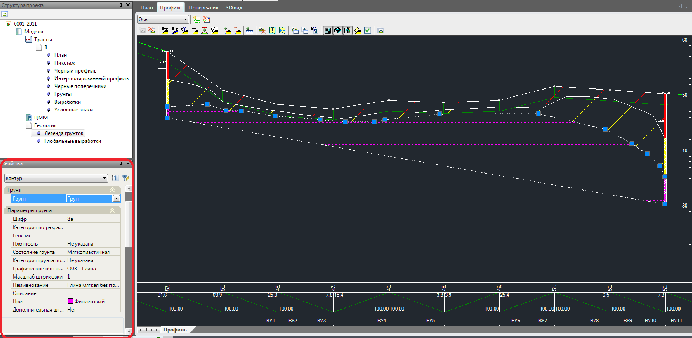
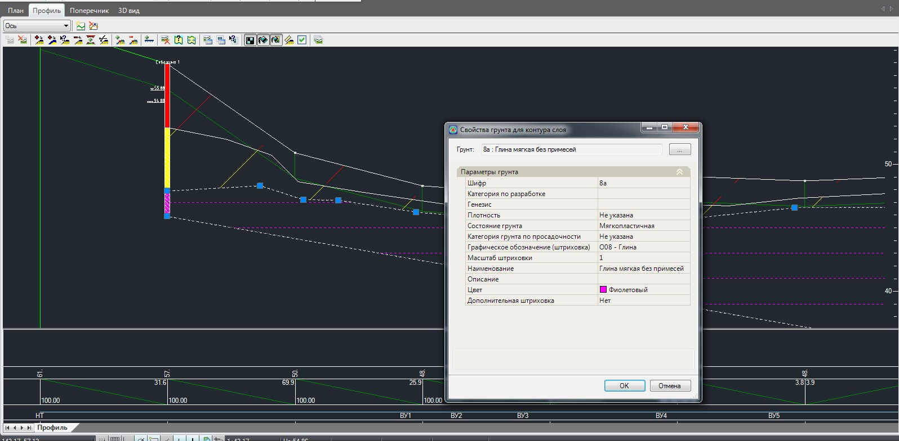
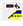
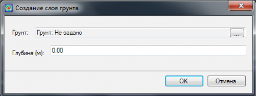

# Редактирование контуров геологических слоев

Для выбора какого-либо геологического слоя на продольном профиле щелкните по его контуру левой кнопкой мыши. В диалоговом окне **Свойства** отобразятся его основные параметры:

Набор свойств, представленный в группе **Параметры грунта**, является информационным и не доступен для редактирования. Модификация данных свойств происходит непосредственно в таблице **Грунты**. Создание и редактирование данной таблицы было описано выше. Следует иметь ввиду, что если в таблицы **Грунты** поменять какой либо параметр, например цвет или тип штриховки, то изменение применится ко всем контурам и скважинам, которым он был назначен.

Также для получения оперативной информации о параметрах грунта выбранного слоя:

1. Воспользуйтесь элементом меню **Задачи - Геология - Свойства контура слоя**. Откроется следующее окно:

   

2. В поле **Параметры грунта** представлены его основные свойства. Они являются информационными и не доступны для редактирования. Если же необходимо задать новый грунт выбранному слою, нажмите кнопку  и укажите двойным щелчком новый грунт из предложенного списка таблицы **Грунты**.
3. Для выхода из данного окна нажмите **ОК**.

С контурами слоев можно производить следующие операции:

* **Для того чтобы переместить какую либо вершину контура**:

  1. Выделите контур, щелкнув по нему левой кнопкой мыши.
  2. Укажите левой кнопкой мыши саму вершину и удерживая ее задайте ей новое местоположение.

     

     Если два слоя имеют смежный узел и оба являются выделенными, то при перемещении вершины одного из слоя автоматически в тоже место будет перемещаться вершина другого.

     

* **Для того чтобы удалить вершину контура**:

  1. Выделите контур, щелкнув по нему левой кнопкой мыши.
  2. Щелкните правой кнопкой мыши по узлу, который требуется удалить. Из появившегося контекстного меню выберите пункт **Удалить узел**. Также можно воспользоваться элементом меню **Задачи - Геология -Удалить узел контура слоя** или кнопкой  на панели **Геология**.

* **Для добавления дополнительного узла контуру геологического слоя**:

  1. Выберите элемент меню **Задачи - Геология -Добавить узел контура слоя** или кнопку  на панели **Геология**. Курсор примет форму прицела.
  2. Укажите левой кнопкой мыши точку на сегменте контура, на котором необходимо добавить узел. Если под данной точкой расположен контур другого геологического запроса, то необходимо уточнить какой из контуров редактируется, щелкнув по нему левой кнопкой мыши.
  3. Укажите левой кнопкой мыши положение дополнительного узла контура.

 

* **Для удаления контура** слоя укажите его левой кнопкой мыши и выберите элемент меню **Задачи - Геология -Удалить слой**, или нажмите кнопку  на панели **Геология**.

 

* Иногда возникает **необходимость в отрисовке протяженных слоев постоянной толщины**, например задание растительного слоя. Для этого:

  1. Воспользуйтесь элементом меню **Задачи - Геология -Добавить параллельный слой**. Откроется следующее окно:

     

  2. Нажмите кнопку  и выберите грунт двойным щелчком левой кнопки мыши из раскрывшейся таблицы **Грунты**.
  3. В поле глубина задайте значение  глубины создаваемого слоя. Значение глубины задается относительно линии черного профиля.
  4. Нажмите **Ок**.

  В результате, будет создан слой постоянной толщины, верхняя и нижняя граница которого параллельна линии черного профиля.

  

  При создании параллельного слоя также контролируется условие не пересекаемости предварительно созданных контуров. Т.е. новый слой может быть вложенным в существующие, но не может их пересекать. При обнаружении пересечения на этапе построения параллельного слоя программа выдаст соответствующие предупреждение и не создаст его.

  

* При необходимости **объединения двух геологических контуров в один**:

  1. Выберите элемент меню **Задачи - Геология - Объединить два контура слоя**.
  2. Последовательно укажите левой кнопкой мыши первый и второй контур. Откроется таблица грунтов. 
  3. Дважды щелкните левой кнопкой мыши по строке с грунтом, который необходимо назначить объединенному контуру.

   
  В результате, два геологических контура будут объединены в один.
