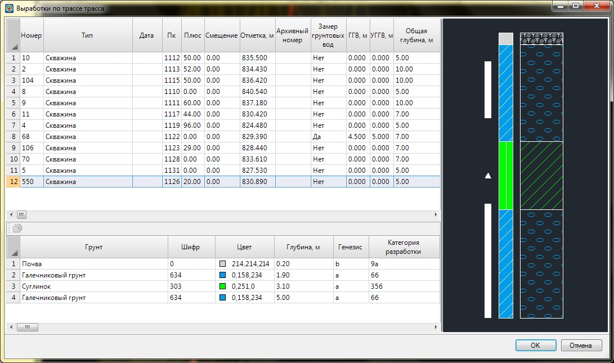
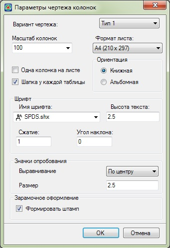
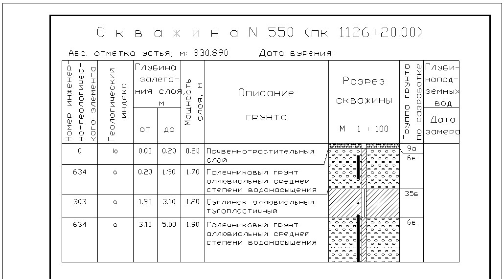

# Формирование чертежей

Геологические разрезы, нанесенные на профиль и поперечники, отображаются также на их выходных чертежах. Для формирования требуемого чертежа выберете элемент меню **Проект - Создать чертеж…**



 Более подробно процедура формирования чертежей была описана в разделе [Чертежи и ведомости](../../doc/index.yaml).



 Созданные выработки, также отображаются соответствующими условными обозначениями на топографическом плане. Для создания чертежа топографического плана воспользуйтесь элементом меню **Проект – Экспортировать ситуация** или **Рисовать – Планшет - .....** Механизмы формирования чертежей топографических планов подробно описывались в разделе [Создание чертежей топографических планшетов](../../doc/create_drawings_topographic_tablets.md).

Также, программа позволяет формировать чертежи-схемы выбранных геологических выработок.

Для этого:

1. Выберите элемент меню **Задачи - Геология - Создать чертеж…**.

2. В результате, в зависимости от выбранной команды, откроется таблица глобальных выработок проекта или таблица выработок текущей трассы:

   

3. Левой кнопкой мыши выберите выработки, по которым нужно сформировать чертежи - схемы. Откроется окно выбора параметров формирования чертежа:

   

4. В данном окне можно задать следующие параметры:

   * **Вариант чертежа** - в данном выпадающем списке имеется возможность выбрать четыре варианта формирования данных в чертеже.

     

     Варианты отличаются между собой набором и форматом выходных данных, положением подписей и т.д.

     

   * **Масштаб колонок** – из выпадающего списка выберите значение вертикального масштаба выработок, используемое при формировании чертежа.

     Также, в данном окне можно выбрать форматы листов, на которых будут отрисованы выработки, ориентацию этих листов, и способ компоновки выработок по листам: одна выработка на лист или несколько выработок на листе.

   * Поле **Шрифт** содержатся настройки выбора имени шрифта, высоты, сжатия и наклона.
   * В поле **Значки опробавания** задаются параметры выравнивания и размера значков опробования.
   * В разделе **Зарамочное оформление** имеется возможность настроить отрисовку рамок и штампа на листах.
    

5. Задайте необходимые параметры формирования чертежа и нажмите **ОК**.

В результате, программа сформирует чертежи выбранных колонок и откроет их для просмотра или редактирования:

