# 3D-модель геологии

**3D-модель геологии** является одним из способов представления геологических изысканий в Robur. Представление геологии в виде 3D-модели дает пользователю ряд преимуществ. Например, при наличии **3D-модели геологии** можно моментально получить геологический разрез в абсолютно любом месте ведения изысканий и без привязки к конкретной трассе/дороге.

#|
||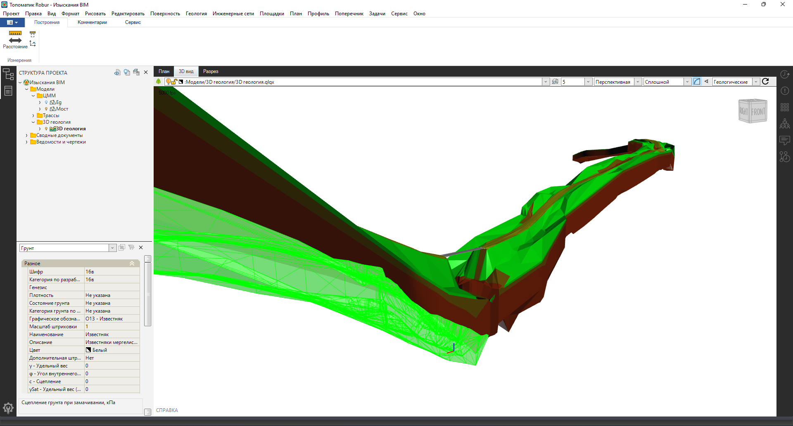||
||**3D-модель геологии** в рабочем окне **3D вид**. Для наглядности задано искажение по вертикали.||
|#

## Данные для построения 3D-модели геологии

В качестве исходных данных для построения **3D-модели геологии** в программе выступают:

* Поверхность земли.
* Набор выработок.
* Набор разрезов.



**3D-модели геологии** автоматически строится по совокупности этих элементов. Однако если имеются только выработки или разрезы, то **3D-модель геологии** автоматически может построиться используя только их.



## Данные о поверхности земли

Активируйте модель **Геология**  или создайте новую в **Структуре проекта** и откройте ее настройки (**ПКМ - Настройки**).

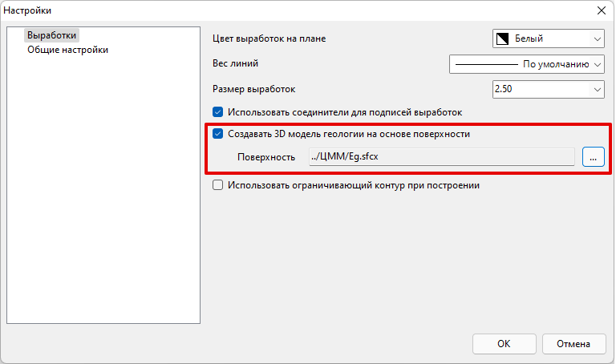

Включите позицию **Создавать 3D-модель геологии на основе поверхности** и выберите саму поверхность земли в качестве основы для **3D-модели геологии**.



В качестве поверхности земли для **3D-модели геологии** выбирается, как правило, поверхность существующего рельефа, которая строится в модели типа **ЦММ** 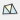.



## Набор выработок

Выработки бывают **Основными** и **Снесенными**.

Чтобы нанести **Основные** выработки, заполните таблицу глобальных выработок (см. [Создание таблицы глобальных выработок](creation_table_global_workings.md)).



Предварительно должна быть заполнена таблица глобальных грунтов (см. [Создание легенды грунтов](creation_legend_ground.md)).



#|
||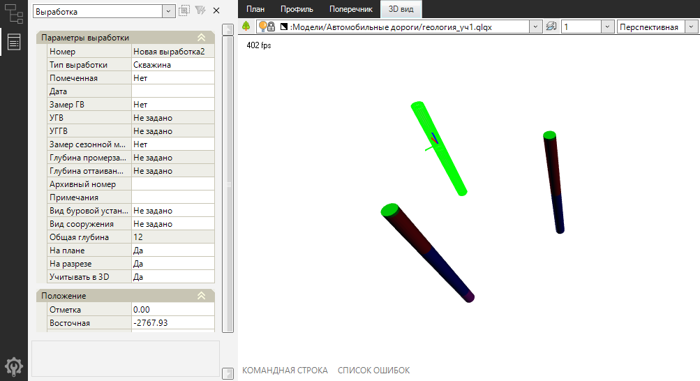||
||Вид выработок в окне **3D вид**.||
|#

**Снесенные** выработки могут быть использованы, например, для снесения данных по **Основной** выработке на проходящий рядом, но не пересекающий **Основную** выработку, разрез. Таким образом **Снесенные** выработки выступают в роли вспомогательного элемента при построении геологии.

Чтобы создать **Снесенную** выработку, в рабочем окне **План** нажмите **ПКМ** по выработке, из контекстного меню выберите **Снести выработку** и укажите ее новое положение на плане.

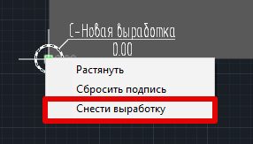



Выработка автоматически попадает на разрез в случае, если разрез пересекает ее или проходит с незначительным отклонением от нее.



## Набор разрезов

В активной модели **Геология**  разрезы наносятся в рабочем окне **План**, а непосредственное редактирование геологических слоев в них происходит в специализированном рабочем окне **Разрез**.

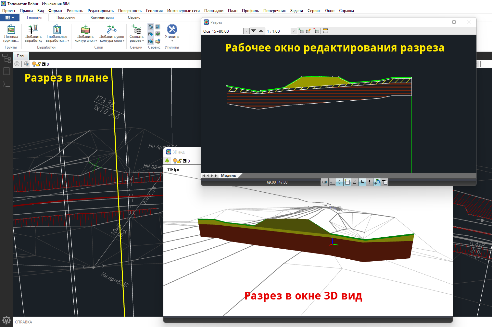

На плане в границах поверхности земли разрезы можно наносить в абсолютно любом месте.

Более подробно о разрезах сказано ниже в [Уточнение и редактирование 3D-модели геологии](../../rb_survey/glg/geology_3d_model.md#utochnenie-i-redaktirovanie-3d-modeli-geologii).

## Построение 3D-модели геологииn

По нанесенным выработкам (даже одной выработке) автоматически построится **3D-модель геологии**. Увидеть это можно в рабочем окне **3D вид**.

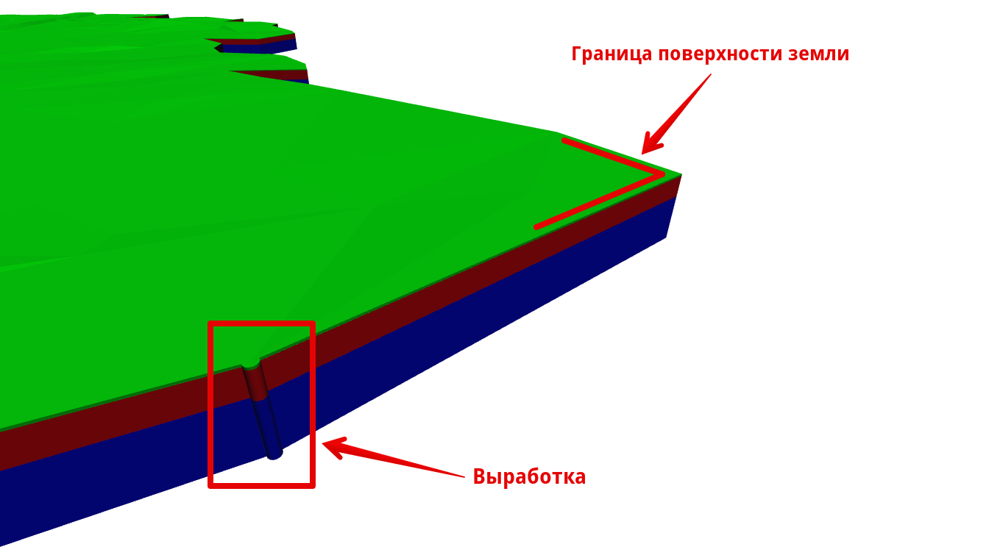

По умолчанию **3D-модель геологии** будет построена под всей площадью поверхности земли. **3D-модель геологии** является динамической, т. е. автоматически перестраивается при внесении тех или иных изменений, например, при изменении мощности геологического слоя в выработках.



Если в каких-либо местах необходимо уточнить построенную по набору выработок **3D-модель геологии**, создайте разрезы в этих местах.



## Уточнение и редактирование 3D-модели геологии

Для уточнения геологии, как правило, используются разрезы.

Чтобы создать разрез, во вкладке "Геология" на ленте нажмите кнопку **Создать разрез** 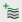.

Программа предложит выбрать модель, например, автомобильной/железной дороги, геодезической трассы или любой другой линейный объект, например, полилинию. Если требуется навести разрез самостоятельно, то нажмите **ПКМ** во время данного запроса и из контекстного меню выберите **Указать точки**.

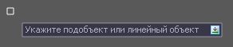

В случае, если указать модель трассы/дороги, то программа предложит создать разрезы по продольному и/или поперечным профилям. Также будет дана возможность выбора заполнять ли секции геологии на разрезах данными о слоях, взятых непосредственно с **3D-модели геологии**, или же оставить создаваемые разрезы пустыми.

#|
||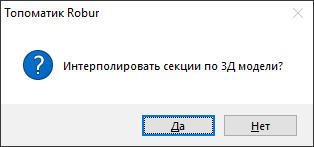 {.cell-align-center}||
||**Да** - автоматически заполнит создаваемый разрез/ разрезы контурами грунтов согласно их геометрии в этом месте/местах в **3D-модели геологии**. **Нет** - создаваемые разрезы будут пустыми.||
|#

Чтобы отредактировать созданные разрезы, перейдите в рабочее окно **Разрез** и выберите необходимый из селектора:

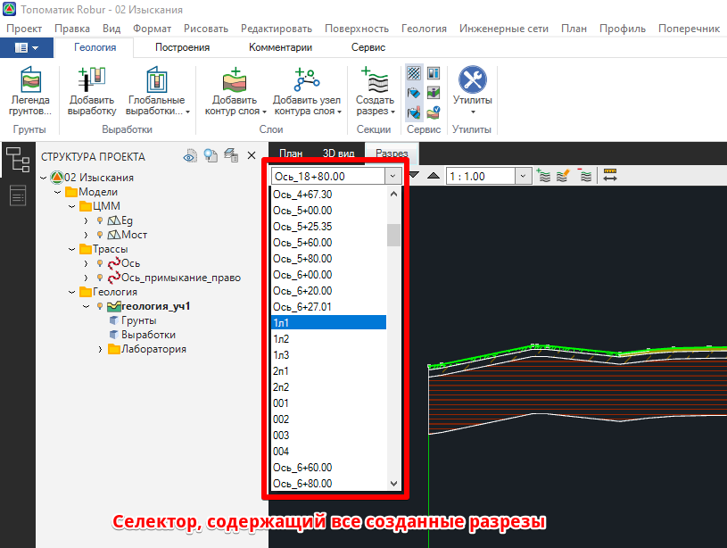

Кроме того, чтобы переключаться между разрезами, можно использовать клавиши **PgUp**/**PgDn**.

Для редактирования уже отрисованных слоев на разрезах и создания новых в данном рабочем окне можно использовать инструментарий для работы со слоями геологии, описанный в разделе [Геология](editing_contours_geological_layers.md).

Все внесенные изменения на разрезах сразу же отражаются на **3D-модели геологии**.

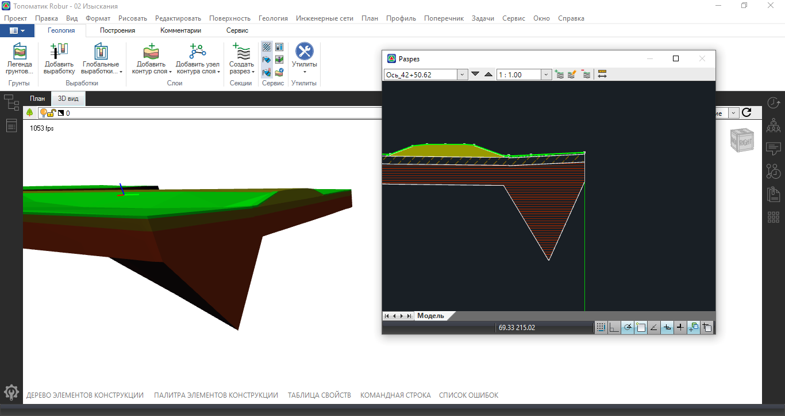

## Отображение 3D-модели геологии на профилях трасс/дорог

Чтобы включить отображение **3D-модели геологии** на продольном и поперечном профилях трасс/дорог в настройках моделей этих трасс/дорог необходимо сослаться на нее.

Для этого нажмите **ПКМ** по интересующей модели трассы/дороги в **Структуре проекта** и из контекстного меню выберите **Настройки**. Перейдите в раздел **Геологические модели** и выберите из списка необходимую модель геологии:

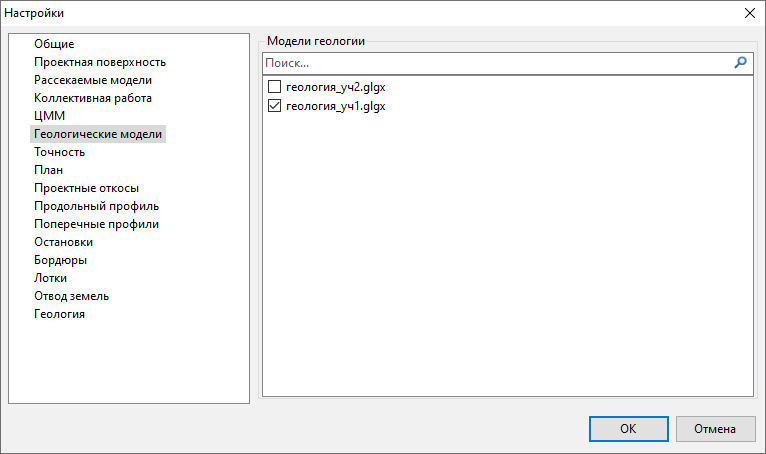



Для моделей трасс/дорог можно назначать неограниченное количество **3D-моделей геологии**.

Неограниченному количеству моделей трасс/дорог можно назначать одну и ту же **3D-модель геологии**.



Теперь данные геологии согласно ее 3D-модели будут проецироваться на продольные и поперечные профили трассы/дороги.



Обратите внимание, что на продольные и поперечные профили трасс/дорог данные о слоях проецируются непосредственно с **3D-модели геологии**. Поэтому для уточнения геологии на том или ином продольном/поперечном профиле трассы/дороги активируйте модель **Геология** , по этому продольному/поперечному профилю введите разрез и скорректируйте контуры слоев уже на нем.



## Построение 3D-модели геологии на основе слоев, нанесенных классическим способом на трассе/дороге

Если в проекте имеются модели трасс/дорог с уже нанесенными слоями геологии на их продольные и поперечные профили классическим способом (см. раздел [Геология](application_geological_layers.md)), то построить **3D-модель геологии** по этим "старым" данным можно так:

1. Активируйте или создайте новую модель **Геология**  в **Структуре проекта**.
2. Перейдите в настройки этой модели геологии и укажите для нее поверхность земли, если этого не было сделано раньше, см. [Данные для построения 3D-модели геологии](../../rb_survey/glg/geology_3d_model.md#dannye-dlya-postroeniya-3d-modeli-geologii).
3. Во вкладке «Геология» на ленте нажмите кнопку **Создать разрез**  и выберите модель трассы/дороги, на профиле/профилях которой имеются данные "старой" геологии.

Далее, наряду с основным диалогом по созданию разреза, программа предложит скопировать содержимое "старой" геологии на создаваемый разрез/разрезы:

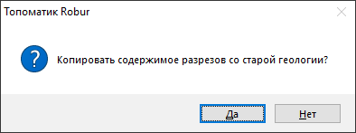

* **Да** - перенесет слои "старой" геологии в создаваемый разрез/разрезы.
* **Нет** - проигнорирует перенос слоев "старой" геологии в создаваемый разрез/разрезы. В таком случае программа предложит взять данные о слоях из **3D-модели геологии** аналогично описанному выше в [Уточнение и редактирование 3D-модели геологии](../../rb_survey/glg/geology_3d_model.md#utochnenie-i-redaktirovanie-3d-modeli-geologii).

## Управление видимостью 3D-модели геологии

Чтобы управлять видимостью слоев геологии на её 3D-модели в рабочем окне **3D вид**, активируйте соответствующую модель **Геология**  в **Структуре проекта** и используйте селектор:

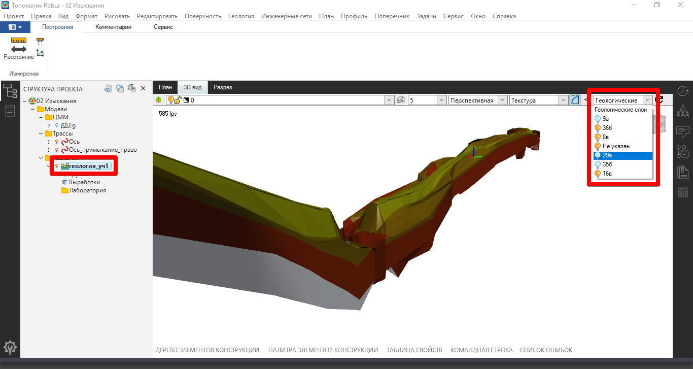

В рабочих окнах **Профиль** и **Поперечник** при активной модели трассы/дороги слои **Динамические контура/выработки** отвечают за видимость данных геологии, спроецированных с **3D-модели геологии**:

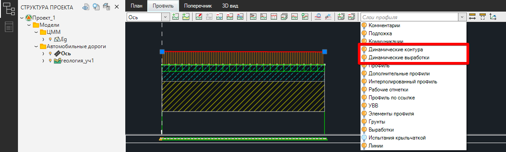

## Настройка вывода данных 3D-модели геологии на чертеж

Чтобы на чертеж продольного/поперечного профиля дороги выводились данные **3D-модели геологии**, то при создании соответствующего чертежа убедитесь, что в **Мастере создания чертежей** в разделе **Геология** выставлена опция **Динамическая геология**:

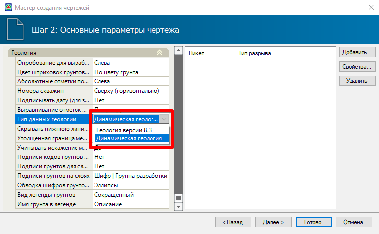

Подробнее о создании чертежей продольного/поперечного профилей см. [Чертежи и ведомости](../../doc/edit_dynamic_drawing/general_information.md).
