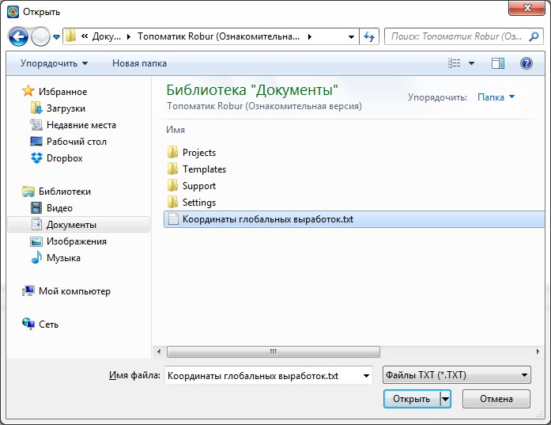
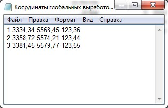

# Импорт координат выработок из текстового файла

Функция позволяет импортировать координаты глобальных выработок в формате текстового файла (\*.txt).

Для этого:

1. На панели окна **Глобальные выработки** (меню **Задачи – Геология**) нажмите кнопку  , откроется диалоговое окно:

   

2. Выберите текстовый файл, в котором содержатся данные по глобальным выработкам.

   Формат импортируемого текстового файла:

   

 * 1 столбец – **Номер выработки.**
 * 2 столбец – **Северная координата.**
 * 3 столбец – **Восточная координата.**
 * 4 столбец – **Отметка.**

   

   1. Все данные в столбцах разделяются пробелом.
   2. Номер в первом столбце должен соответствовать номеру созданной глобальной выработки.
   3. Функция не создает новые выработки, а непосредственно импортирует для имеющихся в списке глобальных выработок данные.

   
