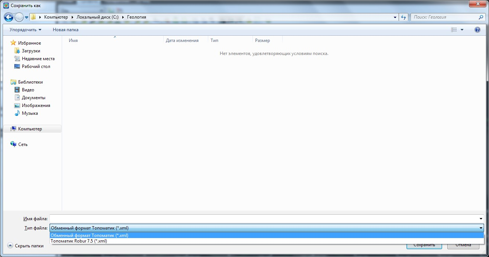
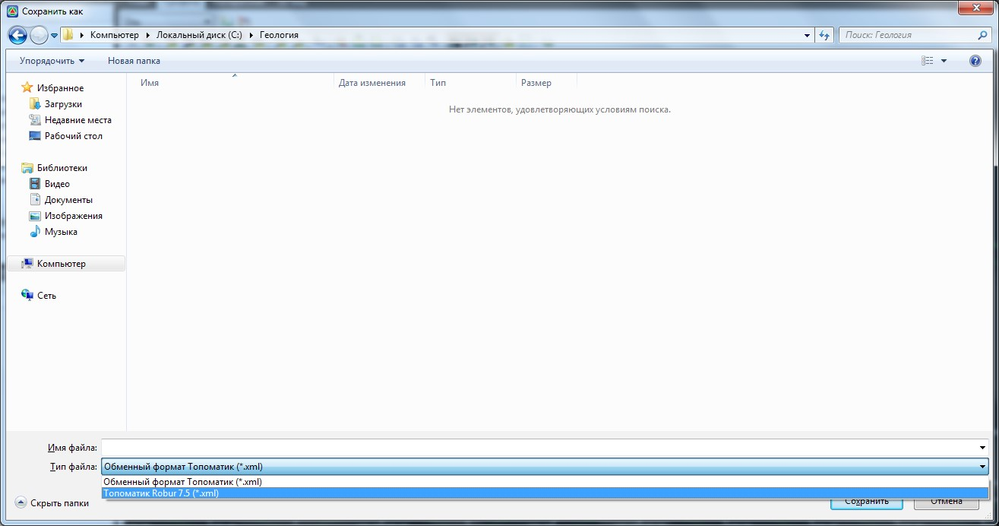

# Импорт/экспорт геологических данных

Программа позволяет экспортировать геологические данные (грунты, выработки, геологические контуры) в файл обменного формата **Топоматик Robur**. В последствие, к примеру, эти данные могут быть импортированы в другую трассу. В том числе, геология может экспортироваться в другие программные приложения, поддерживающие чтение данного файла обменного формата.

* Для экспорта геологических данных в основной файл обменного формата:

1. Выберите элемент меню **Задачи - Геология - Экспортировать геологию**.

   

   Если элемент меню **Задачи - Геология - Экспортировать геологию** является неактивным, то необходимо проверить является ли текущей модель группы **Трасса (Автомобильная дорога или Железная дорога)**. Если текущей является отличная модель (**ЦММ, Геология** и т.п.), то необходимо сделать текущей соответствующую модель группы **Трасса (Автомобильная дорога или Железная дорога)**. Процесс назначения/смены текущей модели подробно описан в разделе [Структура проекта](../../install_startup/startup/structure_project/structure_project.md).

   

 2. В открывшимся окне **Сохранить как**, в поле **Тип файла** выберите **Обменный формат Топоматик**:

    

    В поле **Имя файла** укажите наименование сохраняемого файла. Также, при необходимости измените папку, в которую будет сохранен данный файл.

3. Нажмите кнопку **Сохранить**.

* Для импорта геологических данных из файла обменного формата:
  1. Выберите элемент меню **Задачи - Геология - Импортировать геологию**.
  2. В открывшимся окне **Открыть**, в поле **Тип файла** выберите **Обменный формат** **Топоматик** и откройте папку, в которой содержится импортируемый файл.
  3. Щелкните по импортируемому файлу дважды левой кнопкой мыши.
   

* Для экспорта или импорта геологических данных из/в старый формат (используемый программами **Robur-Road 7.5** или **Robur-Rail 3.2**) в окне **Сохранить как** или **Открыть**, в поле **Тип файла** необходимо выбрать **Топоматик Robur 7.5**:

  

  Геологические данные, которые содержит текущая трасса, могут экспортироваться полностью или частично. Для экспорта определенной таблица (грунты или выработки) можно воспользоваться деревом структуры проекта. Для этого:

  1. С помощью меню **Вид – Структура проекта** откройте данное окно.
  2. В дереве структуры проекта раскройте список таблиц модели, геологические данные которой необходимо экспортировать. Щелкните правой кнопкой по соответствующей таблице и выберите из появившегося контекстного меню пункт **Экспортировать**:

     

     При необходимости импорта данных в таблицу, выберите пункт **Импортировать**. Дальнейшая последовательность действий аналогична описанной выше.

Аналогичным образом, с помощью дерева проекта могут импортироваться/экспортироваться глобальные библиотеки грунтов и выработок. К примеру, данным образом легенда грунтов может передаваться из одного проекта в другой.
