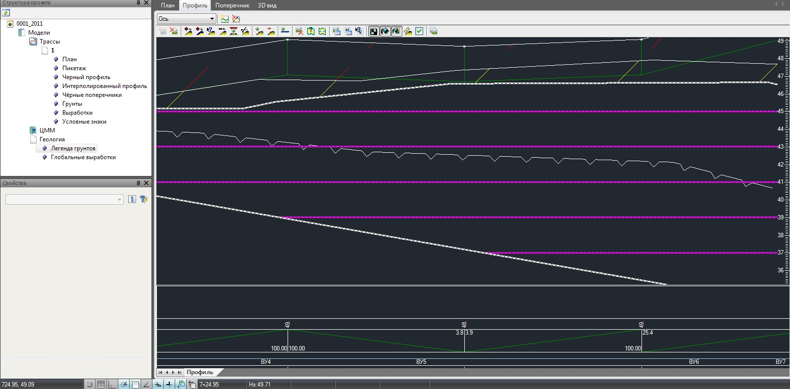

# Нанесение линии вечной мерзлоты

Линия вечной мерзлоты может быть нанесена на продольный и поперечные профили.

Для этого:

1. Сделайте текущим сечение (профиль или поперечник) на которое необходимо нанести данную линию.
2. Выберите элемент меню **Геология - Добавить линию вечной мерзлоты**.
3. Курсор примет форму прицела, последовательно левой кнопкой мыши укажите вершины контура линии вечной мерзлоты.
4. Для выхода из режима ввода щелкните правой кнопкой мыши и выберите из появившегося контекстного меню пункт **Закончить ввод**.

   

В результате линия вечной мерзлоты отобразится на геологическом разрезе соответствующим условным обозначением.
