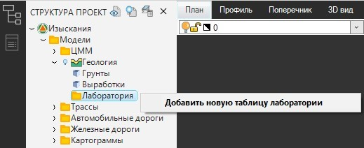
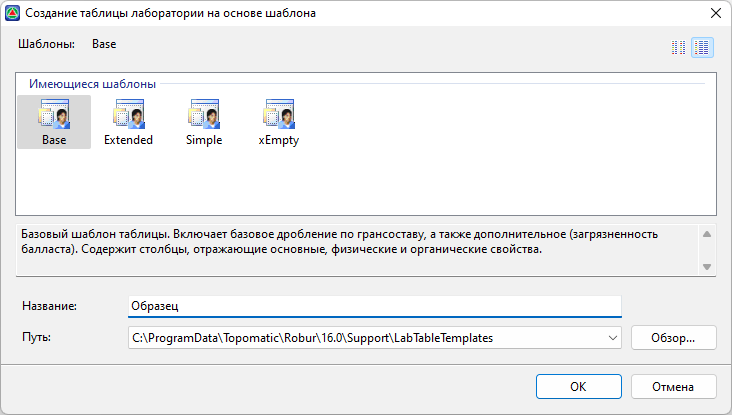
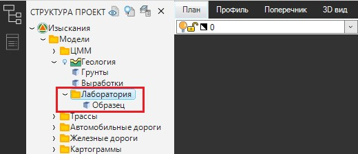

# Создание Общей таблицы лаборатории

Создание **Общей таблицы лаборатории** осуществляется в **Структуре проекта**, в модели **Геология/Лаборатория**.



Обратите внимание на то, чтобы в **Структуре проекта** была создана модель **Геология** . В случае, если она отсутствует, щелкните **ПКМ** по любой папке в **Структуре проекта** и из контекстного меню выберите **Добавить - Геология**:  



Раскройте дерево данной модели, нажмите ПКМ на папку **Лаборатория** и выберите **Добавить новую таблицу лаборатории**:



В рамках одной модели **Лаборатории** может быть создано неограниченное количество **Общих таблиц лаборатории**.



Откроется окно, в котором представлены имеющиеся в программе Системные шаблоны и краткое их описание (см. раздел [Шаблоны](description_template.md)), показан путь хранения шаблонов, который при необходимости можно изменить (см. раздел [Работа с Пользовательским шаблоном](description_template.md)):

Выберите шаблон на базе, которого будет создана **Общая таблица лаборатории**, введите имя шаблона в поле **Название** и нажмите **ОК**. В **Структуре проекта**, в папке **Лаборатория**, появится элемент **Общей таблицы лаборатории**:

