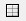
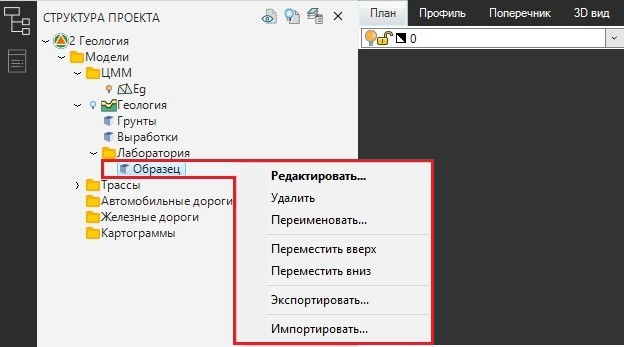
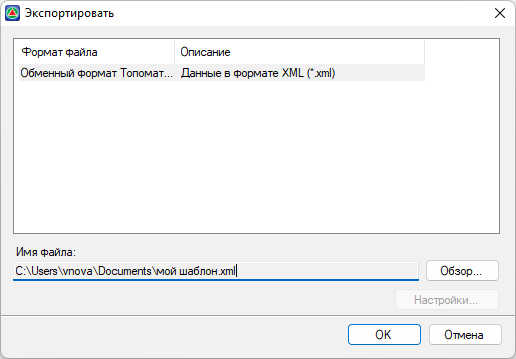
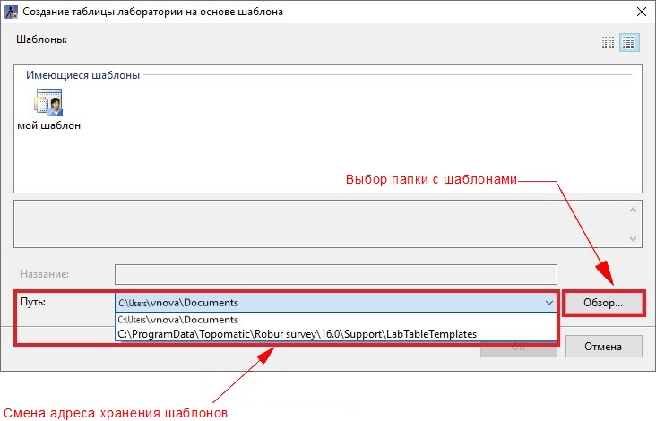
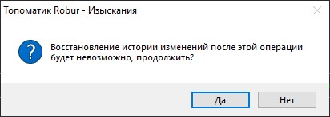

# Шаблоны

По умолчанию, в программе уже присутствуют несколько типов **Системных шаблонов** таблиц лаборатории (см. раздел Системные шаблоны). Дополнительно, на основе **Системного шаблона**, можно сформировать **Пользовательский шаблон**лабораторной таблицы (см. раздел Работа с Пользовательским шаблоном).  

Выбор типа шаблона, как было описано ранее в разделе <em>Создание таблицы лаборатории</em>, осуществляется через окно <em>Создание таблицы лаборатории на основе шаблона</em>:



**Системный шаблон** общей таблицы лаборатории это уже настроенный формат таблицы, в которой каждому столбцу присвоен **Идентификатор** (см. раздел [Термины и определения](terms_and_definition.md)) и заданы определенные параметры (см. раздел [Управление таблицей](table_management.md)).



Системные шаблоны хранятся в каталоге `C:\ProgramData\Topomatic\"наименование программы"\16.0\Support\LabTableTemplates`.



**Типы Системных шаблонов**

<u>*Base (Базовый шаблон таблицы)*</u>

Данный шаблон содержит базовый набор столбцов и их параметров.

<u>*Extended (Расширенный шаблон таблицы)*</u>

Данный шаблон содержит максимальное количество столбцов таблицы, что удобно для формирования на основании него Пользовательского шаблона.

<u>*Simple (Простой шаблон таблицы)*</u>

В данном шаблоне присутствует минимальное количество столбцов таблице. Такой тип шаблона применяют, например, для графического отображения опробований на геологических разрезах, когда расчет лабораторных исследований производится в других программных продуктах.

<u>*xEmpty (Пустой шаблон таблицы)*</u>

В данном шаблоне отсутствуют столбцы таблицы, он предназначен для создания Пользовательского шаблона с нуля.





Функционал программы позволяет создавать **Пользовательские шаблоны**. Это значит, что за основу как правило берется один из **Системных шаблонов**, в нем настраивается нужным образом вид таблицы и параметры ее столбцов и далее такая таблица экспортируется во внешний файл.

Для создания **Пользовательского шаблона**:

1. Создайте и откройте **Общую таблицу лаборатории** выбрав один из **Системных шаблонов** (см. раздел [Создание Общей таблицы лаборатории](create_table_laboratory.md)).
2. На панели инструментов выберите **Управление таблицей**  (см. разделы [Работа с окном Таблица лаборатории](working_window_table_laboratory.md) и [Управление таблицей](table_management.md)).
3. Настройте вид и параметры столбцов таблицы.
4. Нажмите **ОК**, чтобы выйти из таблицы и сохранить внесенные изменения.

После создания **Пользовательские шаблоны** подлежат дальнейшему их использованию путем экспорта/импорта через обменный формат **\*.XML**:

1. Чтобы экспортировать настроенную таблицу, в **Структуре проекта** нажмите ПКМ на **Общую таблицу лаборатории** (шаблон которой необходимо сохранить) и из контекстного меню выберите **Экспортировать**:

   

   Откроется окно Экспорта файла таблицы лаборатории, в котором необходимо указать путь сохранения Пользовательского шаблона:

   

2. Чтобы воспользоваться экспортированным шаблоном, на этапе создания новой таблицы лаборатории (см. раздел [Создание Общей таблицы лаборатории](create_table_laboratory.md)) нажмите **Обзор**. В открывшемся окне выберите папку, в которой находится экспортированный шаблон, и нажмите **ОК**. Шаблон появится в поле *Имеющиеся шаблоны* и будет доступен для дальнейшего использования. Программа запомнит выбранный путь хранения шаблонов и для быстрой смены адреса их хранения, раскройте селектор в поле **Путь** и выберите нужный адрес:

   



Каталог `C:\ProgramData\Topomatic\\*наименование программы\*\16.0\Support\LabTableTemplates\` является местом хранения **Системных шаблонов** по умолчанию. Настоятельно **НЕ** рекомендуем хранить **Пользовательские шаблоны** в данном каталоге, так как при удалении/переустановке программы они будут потеряны.



Кроме того импорт **Пользовательского шаблона** может быть осуществлен через контекстное меню **Общей таблицы лаборатории** в **Структуре проекта**, аналогично экспорту. В окне Импорта файла таблицы лаборатории после выбора пути расположения **Пользовательского шаблона**, нажмите **ОК**. Появится предупреждение:

Нажмите ДА, чтобы полностью заменить данные уже созданной **Общей таблицы лаборатории** в **Структуре проекта** данными импортируемого **Пользовательского шаблона**. В противном случае (при нажатии НЕТ) **Пользовательский шаблон** импортирован не будет.



Обратите внимание на то, что описанный выше функционал по экспорту/импорту можно использовать также для обмена **Общими таблицами лаборатории** с уже заполненными данными, а не только для их использования в качестве **Пользовательского шаблона**.




