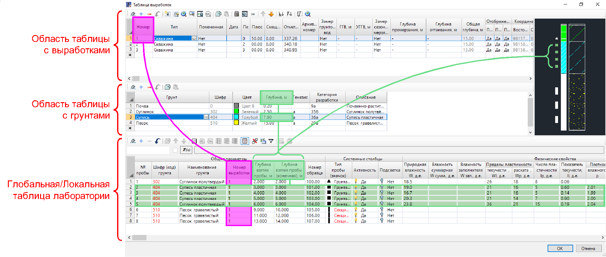
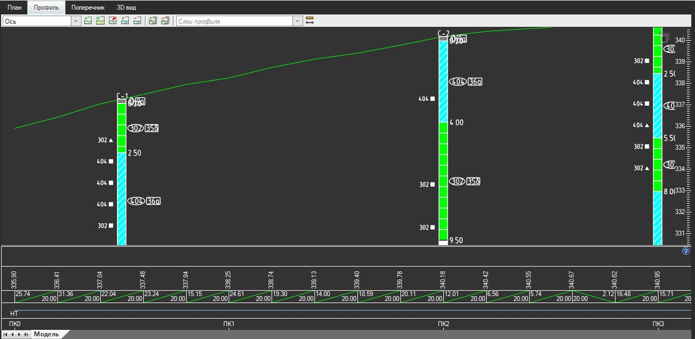
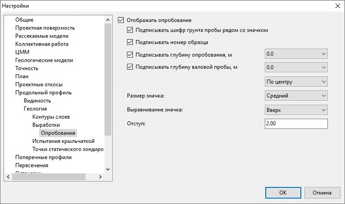

# Распределение проб лаборатории по выработкам

Robur позволяет связывать имеющиеся пробы с **Глобальными** и **Локальными таблицами выработок** (см. разделы [Создание таблицы глобальных выработок](../creation_table_global_workings.md) и [Создание таблицы выработок](../creation_table_workings.md)).

Данная функциональная возможность удобна для ведения наглядной аналитической работы по распределению проб по выработкам. Преимуществом данной функциональной возможности является автоматическое и динамическое отображение типов проб (значков) по всей глубине выработок в окне предпросмотра выработки и последующий автоматический вывод проб с подписями по выработке на геологические разрезы в рабочих окнах (**Профиль, Поперечник, Разрез**), а также отрисовка этих данных на выходных чертежах геологии.

Чтобы подгрузить пробы из имеющейся таблицы лаборатории, например, в **Глобальную таблицу выработок**, сделайте следующее:

1. Откройте **Глобальную таблицу выработок** (см. раздел [Создание таблицы глобальных выработок](../creation_table_global_workings.md)).

2. На панели инструментов ЛКМ нажмите пиктограмму  (**Показать/ скрыть данные лаборатории**). В нижней части окна добавится область **Глобальной таблицы лаборатории**.

3. Чтобы импортировать пробы в **Глобальную таблицу лаборатории** из **Общей таблицы лаборатории**, нажмите . Для импорта из **Локальной таблицы лаборатории** нажмите .

4. Пробы загрузятся и отобразятся в **Глобальной таблице лаборатории**.



Импорт, отображение и взаимосвязь проб в **Локальной таблице выработок** аналогичны.



Привязка данных таблицы лаборатории к выработкам и формирующим их грунтам осуществляется по **Ключевым столбцам** «Номер выработки», «Глубина взятия пробы», «Глубина взятия пробы (конечная)» (см. описание **Ключевых столбцов** и **Идентификатор**а в разделе [Термины и определения](terms_and_definition.md)). При выделении выработки – в **Глобальной/Локальной таблице лаборатории** отобразятся все ее пробы. При выделении грунта в этой выработке – подсветятся цветом пробы, которые попали в толщу этого грунта.

<u>*Пример отображения значков типов проб и их подписей на геологическом разрезе:*</u>

Чтобы настроить наличие и вид значков проб и подписей на выработке, перейдите в **Настройки** Текущей модели (см. [Работа с моделями](../../../install_startup/startup/structure_project/work_with_models.md)). Для этого в **Структуре проекта** нажмите ПКМ на модель и из контекстного меню выберите **Настройки**. В открывшемся окне раскройте раздел **Продольный профиль** или **Поперечные профили** (в зависимости на каком разрезе необходимо выполнить настройки), далее раскройте раздел **Геология**, затем **Выработки** и выберите пункт **Опробования**:

Для появления значков проб рядом с выработкой включите опцию **Отображать опробование**, затем станут доступны опции **Подписывать шифр грунта пробы рядом со значком, Подписывать номер образца, Подписывать глубину опробования, Подписывать глубину валовой пробы**. Чтобы назначить выравнивание значков проб относительно глубины взятия пробы, в позиции **Выравнивание значка опробования** выберите из селектора *Вниз, По центру, Вверх*.



Задать аналогичные настройки для всех новых моделей, можно в меню **Сервис – Настройка – Новые модели – тип модели – Продольный профиль/Поперечные профили** (в зависимости на каком разрезе необходимо выполнить настройки) – **Геология** – **Выработки**.


