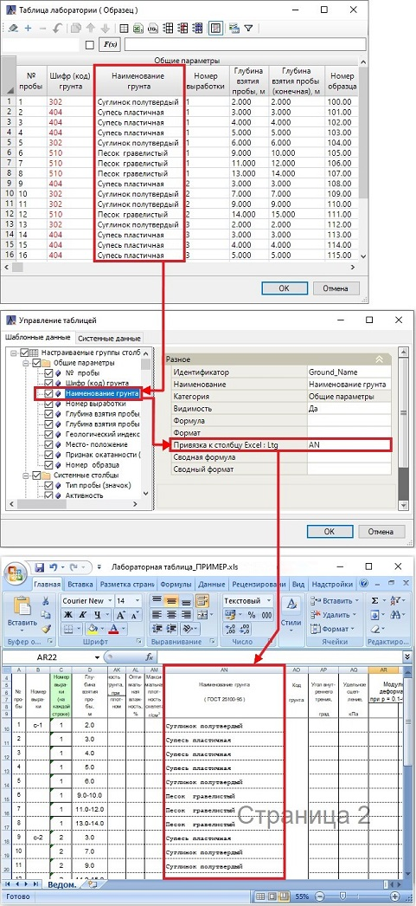
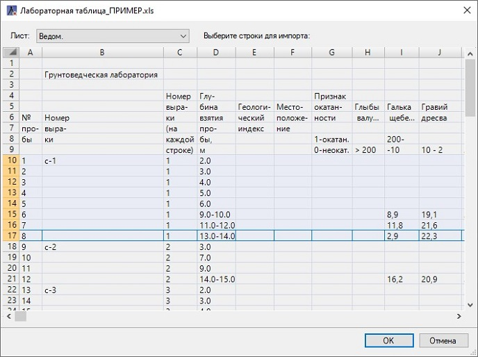
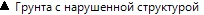
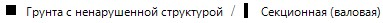

# Загрузка данных лаборатории из стороннего редактора

Robur позволяет загружать данные лабораторных таблиц из файлов формата **\*.XLSX/\*.XLS** (табличный редактор Excel) и файла формата **\*.LTG** (обменный формат программы «Лаборатория»).

Для этого на панели инструментов таблицы лаборатории нажмите кнопку  для загрузки данных из Excel или кнопку  для загрузки данных из **\*.LTG** формата.

В открывшемся окне выберите нужный файл стороннего редактора и нажмите **ОК**.



Для правильной загрузки данных, шаблон лабораторной таблицы должен содержать столбцы, буквенное значение которых совпадает с буквенным значением столбцов стороннего редактора. Этот метод позволяет импортировать данные с распределением их по соответствующим столбцам. Описание настройки шаблонов таблицы лаборатории см. в разделе [Управление таблицей](table_management.md).



Откроется окно с предварительным просмотром данных таблицы стороннего редактора. Выберите строки, которые необходимо загрузить и нажмите **ОК**:

В результате в таблицу лаборатории загрузятся данные из стороннего редактора с учетом привязки буквенных столбцов стороннего редактора и таблицы лаборатории.

<u>**«Автопробы»**</u>

Кроме того, на этапе импорта таблицы лаборатории из файла стороннего редактора Robur может автоматически выставить тип пробы (значок) в зависимости от наличия тех или иных данных в пробе (строке).

Алгоритм автоматического выставления типа пробы (значка) для каждой пробы в таблице следующий:

1. Программа проверяет наличие столбца с идентификатором `Phys\_Density` (см. разделы [Управление таблицей](table_management.md) и [Термины и определения](terms_and_definition.md)) и его привязку к столбцу таблицы стороннего формата. Если столбца с идентификатором `Phys\_Density` в таблице лаборатории нет или привязка к столбцу таблицы внешнего формата отсутствует, то выставляется тип пробы .
Иначе (столбец с идентификатором `Phys\_Density` и его привязка к столбцу таблицы внешнего формата есть) см. пункт 2.

2. Программа проверяет значение в ячейке столбца с идентификатором `Phys\_Density`. Если в этом столбце после импорта таблицы лаборатории из стороннего формата стоит любое числовое значение, и в **Ключевых столбцах** «Глубина взятия пробы» и «Глубина взятия пробы (конечная)» (см. раздел [Термины и определения](terms_and_definition.md)) стоят одинаковые/ неодинаковые значения глубин (диапазона нет/ диапазон есть), то выставляется тип пробы .
