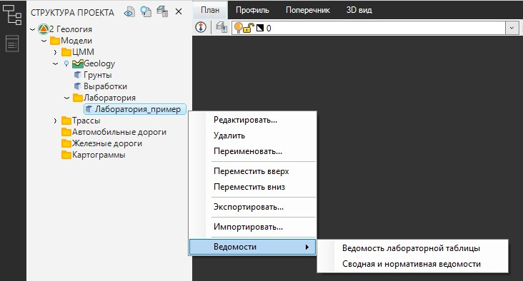
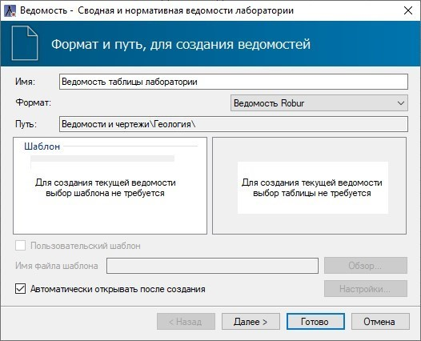
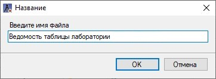

# Формирование лабораторных ведомостей

Robur позволяет формировать **Ведомость лабораторной таблицы** и **Сводную и нормативную ведомости**.



Перед созданием **Сводной и нормативной ведомостей** можно (но необязательно) воспользоваться функцией **Задействованные грунты**. Данная функция поможет автоматически скорректировать наименования грунтов в ведомости согласно их наименованиям в Легенде грунтов (подробнее о данной функции см. раздел [Работа с окном Таблица лаборатории](working_window_table_laboratory.md)).



Чтобы создать ведомости таблицы лаборатории:

1. В **Структуре проекта** нажмите ПКМ на **Общую таблицу лаборатории** и из контекстного меню выберите **Ведомости** - \*тип ведомости\* (**Ведомость лабораторной таблицы** или **Сводная и нормативная ведомости**):

   

2. Откроется окно мастера ведомости, задайте необходимые настройки:

   

   В поле **Имя** задается наименование ведомости, в поле **Формат** можно выбрать ее формат в зависимости от редактора, в котором ведомость должна быть открыта. В поле **Путь** отображается адрес папки, в которую по умолчанию сохраняются все создаваемые ведомости. При необходимости отмены автоматического открывания ведомости после ее создания, снимите «галочку» в поле **Автоматически открывать после создания**.

3. После задания всех настроек нажмите кнопку **Готово**, откроется окно, введите наименование ведомости и нажмите **ОК**:

   

В результате, выбранная ведомость будет сформирована в зависимости от ее формата и добавлена в **Структуру проекта**.



По умолчанию ведомости **Лаборатории** сохраняются в папку с проектом, в папку **Ведомости и чертежи**. Функционал программы позволяет изменить сохранение ведомостей в папку **Модели**, см. раздел Общие настройки подраздел [ Другие.](../../../install_startup/startup/general_setting/design.md)  

Описание работы с ведомостями в формате Robur представлено в разделе [Редактирование динамических выходных ведомостей](../../../doc/dynamic_vedomosti/edit_vedomosti_and_pattern.md)


