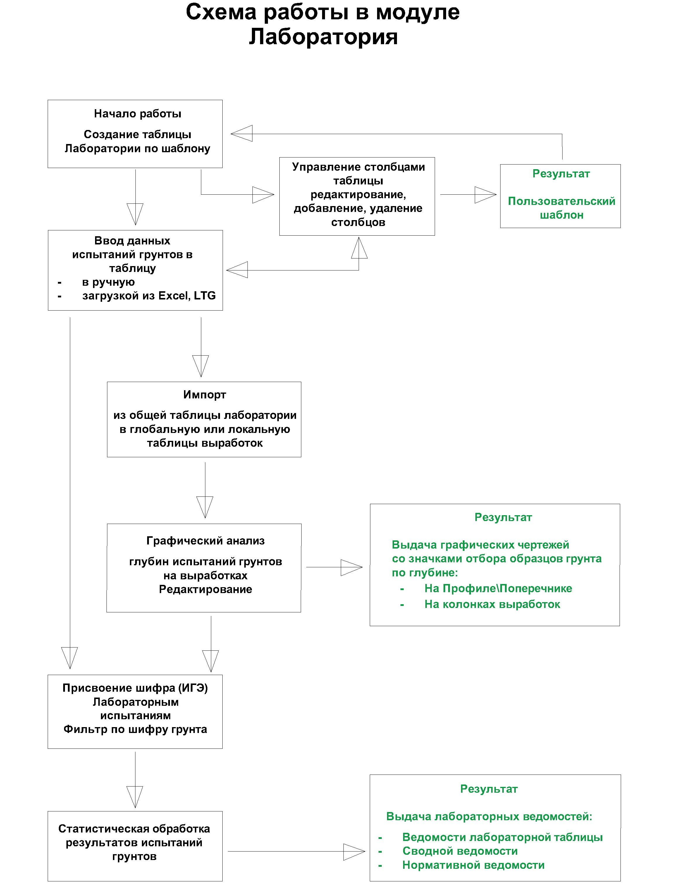

# Общие сведения о Лаборатории в Robur

**Лаборатория** представляет собой набор таблиц, содержащих в себе данные о показателях проб грунтов, испытанных в грунтоведческой лаборатории, и функциональные возможности по их обработке и анализу, а также распределению по выработкам.

Ниже представлен принцип основного направления работы в **Лаборатории**:

* Работа в модуле **Лаборатория** начинается с создания **Общей таблицы лаборатории**, на основе **Системного шаблона**, в **Структуре проекта**. Управление **Общей таблицей лаборатории** позволяет сформировать Пользовательский шаблон.  

   Использование шаблонов позволяет систематизировать единый стиль таблиц лаборатории, а так же значительно экономить время загрузки поступающих данных из сторонних программ, например, Excel.  

   **Лаборатория** может содержать неограниченное количество Пользовательских шаблонов, это позволяет объединять неравномерно поступающие данные испытаний из разных источников в едином Проекте.

* Ввод данных испытаний грунтов в ячейки таблиц лаборатории возможен вручную или с помощью импорта из стороннего редактора (Excel и LTG - формата).

* Далее данные **Общей таблицы лаборатории** импортируется в таблицы **Глобальных** или **Локальных выработок**. Что позволяет провести графический анализ глубин испытаний грунтов на выработках и как результат выдавать графические чертежи с отображением на выработках значков проб и их подписей.

* По завершению работы, функционал программы позволяет объединять и фильтровать массив испытаний грунтов по присвоенному шифру (ИГЭ), выполнять статистическую обработку результатов испытаний с выдачей итоговых выходных ведомостей в табличном редакторе (например, Excel - формата).
