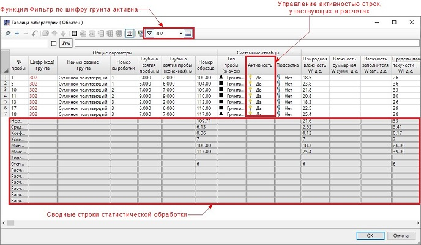
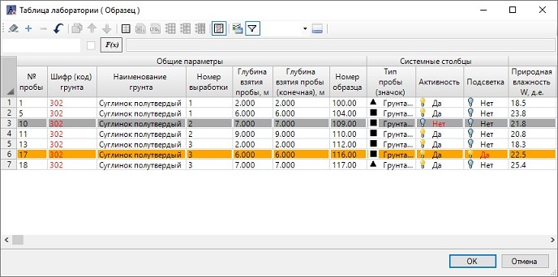
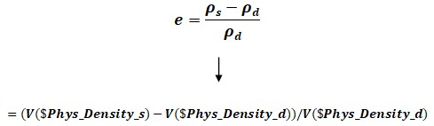

# Статистическая обработка результатов испытаний

В данном разделе описаны инструменты, позволяющие проводить статистическую обработку результатов лабораторных испытаний грунтов.



Здесь и далее описание функционала будет производиться на основе расширенного шаблона Extended. При использовании другого шаблона вид таблицы может отличаться.



Основной функцией проведения статистической обработки данных является **Фильтр по шифру грунта**. Нажмите пиктограмму  на панели инструментов таблицы лаборатории, добавится селектор с выбором шифров грунтов (ИГЭ) и дополнительная кнопка , управляющая видимостью **Сводных строк** статистической обработки (термин **Сводные строки** см. раздел [Термины и определения](terms_and_definition.md)):

Из селектора выберите необходимый шифр грунта (ИГЭ). Программа автоматически, по шифру грунта (ИГЭ), выделит в лабораторной таблице необходимые строки с данными грунтов. Одновременно будет произведен расчет статистических данных испытаний этих грунтов по **Активным строкам** столбцов (термин **Активные строки** см. раздел [Термины и определения](terms_and_definition.md)). Результаты этих расчетов отобразятся в **Сводных строках** статистической обработки.



При изменении значений ячеек в столбцах, или при добавлении\ удалении новых строк с данными, автоматически будет произведен перерасчет результатов статистической обработки.  

Описание изменений видимости расчетных строк статистической обработки см. в разделе [Управление таблицей](table_management.md).



Чтобы исключить участие данных строки в расчетах статистической обработки результатов испытаний, например, если необходимо исключить из расчёта бракованную пробу, отключите активность строки в столбце «Активность». Строка выделится серым цветом и не будет учувствовать в дальнейших расчетах. А так же пробы (строки) не попадут на колонку выработки.

Для наглядности можно выделить цветом выбранную строку. Для этого в столбце «Подсветка» выберите *Да*, строка выделится оранжевым цветом.

При ручном изменении значений в ячейках таблицы лаборатории, цвет текста выделяется красным цветом. Цвет ни на что не влияет и в выходные ведомости не переносится. Для отключения выделения цветом текста см. раздел [Работа с окном Таблица лаборатории](working_window_table_laboratory.md).

<u>*Пример отображения выделенных строк при выбранных опциях столбцов "Активность" и "Подсветка" в таблице лаборатории*:</u>

Также часто является необходимым использование в ячейках таблицы выражений в виде формул. Главная особенность программы при написании формулы в ячейке состоит в том, что сослаться можно на другую ячейку только в рамках той строки, в ячейке которой вводится формула. Поэтому в качестве адреса ячейки достаточно использовать только идентификатор столбца (см. раздел [Термины и определения](terms_and_definition.md)).

Простейший пример построения выражения в виде формулы для расчета Коэффициента пористости (е):

`Phys\_Density\_s` – идентификатор столбца со значением плотности частиц грунта (ρs).

`Phys\_Density\_d` – идентификатор столбца со значением плотности скелета грунта (ρd).

`$` – символ, который всегда необходимо использовать перед написанием идентификатора (адреса ячейки).

`V` – символ, который всегда необходимо использовать перед написанием символа `$` и следующего за ним идентификатора (адреса ячейки). Задача данного символа – преобразовать значение в ячейке в число.



Приведенный выше пример является одним из простейших. Вы можете использовать свои более сложные конструкции, в том числе и с условиями.


