# Управление таблицей

Данная функция предназначена для настройки вида таблицы лаборатории и задания параметров ее столбцов.

Для этого на панели инструментов нажмите пиктограмму , откроется окно:

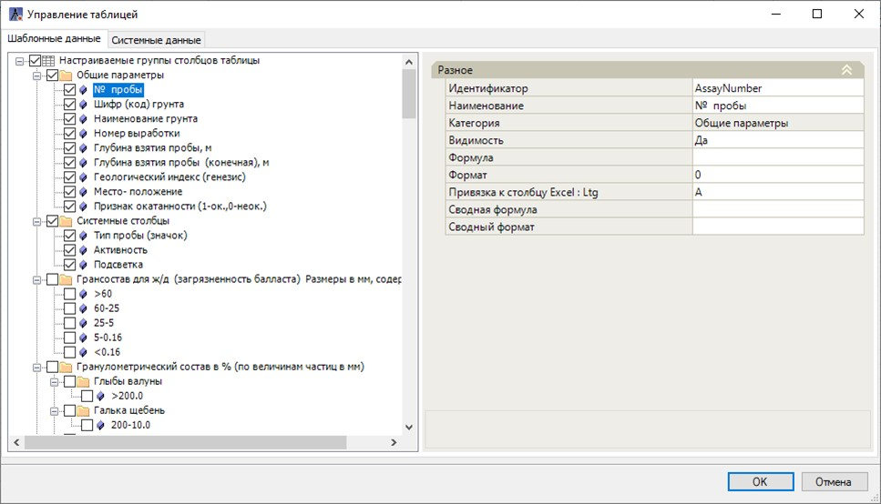

<u>*Вкладка «Шаблонные данные»*</u>

В левой части окна представлена структура таблицы лаборатории. Структура содержит в себе *Столбцы* (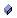), которые собираются в группы/ *Подкатегории* (). Из этой структуры формируется «шапка» таблицы лаборатории:

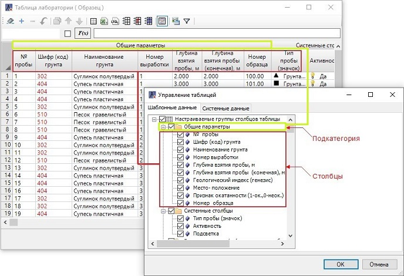

Чтобы добавить новую *Подкатегорию* нажмите ПКМ на начальной позиции дерева структуры или на уже имеющейся *Подкатегории* и выберите **Добавить подкатегорию** (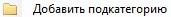).

Чтобы добавить новый *Столбец* нажмите ПКМ на начальной позиции дерева структуры или на уже имеющейся *Подкатегории* и выберите **Добавить столбец** (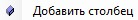).

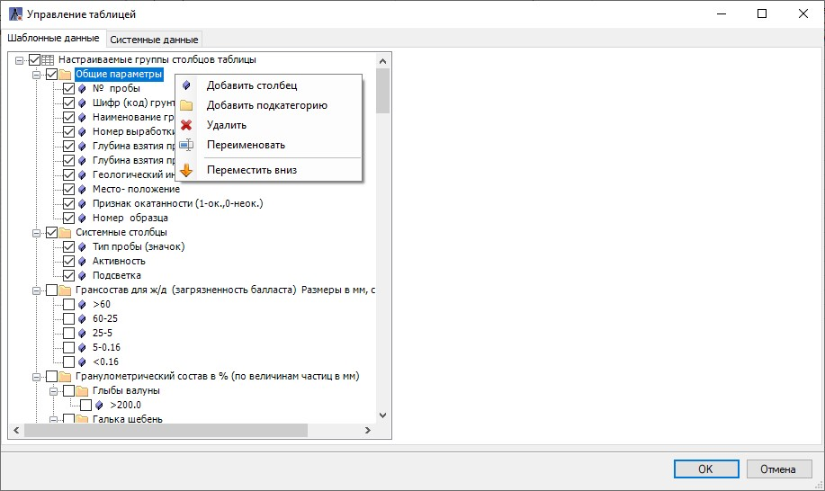

Для удаления подкатегории (и всех вложенных в нее столбцов) выберите **Удалить** ()



Удаленные столбцы полностью исключаются из таблицы (шаблона).



Чтобы изменить имя подкатегории или столбца выберите **Переименовать** (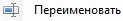). В открывшемся окне введите новое название и нажмите **ОК**:

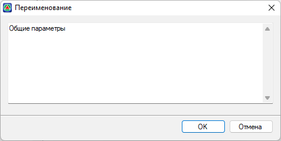

Для изменения порядка подкатегорий и/или столбцов в структуре таблицы нажмите **Перемесить вверх/ Переместить вниз** ().

Чтобы показать/скрыть столбец в таблице лаборатории **включите/отключите** «галочку» возле этого столбца (данная опция аналогична параметру столбца "Видимость", см. описание далее).



Выключенная видимость столбца **НЕ** исключает столбец из таблицы (шаблона). Столбец с выключенной видимостью участвует в расчетах и в него попадают импортируемые данные. Кроме того, столбцы с выключенной видимостью также экспортируются с остальными столбцами таблицы во внешние форматы, но скрытыми.



Для настройки того или иного столбца выделите его ЛКМ. В правой части окна появятся параметры данного столбца:

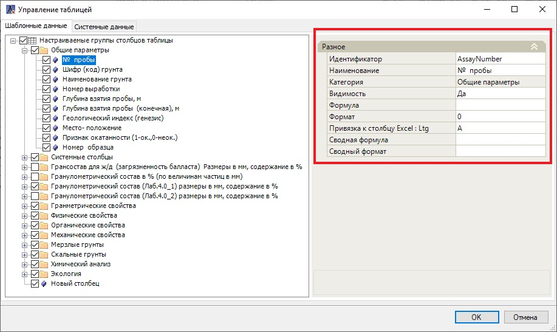

* **Идентификатор** – в данном поле присваивается идентификатор столбца (см. раздел [Термины и определения](terms_and_definition.md)).
* **Наименование** – в данном поле задается имя столбца в «шапке» таблицы лаборатории. Чтобы добавить строку в названии столбца, в поле Наименование нажмите кнопку  , откроется окно, в котором с помощью клавиши **Enter** задайте новую строку и нажмите **ОК**:

  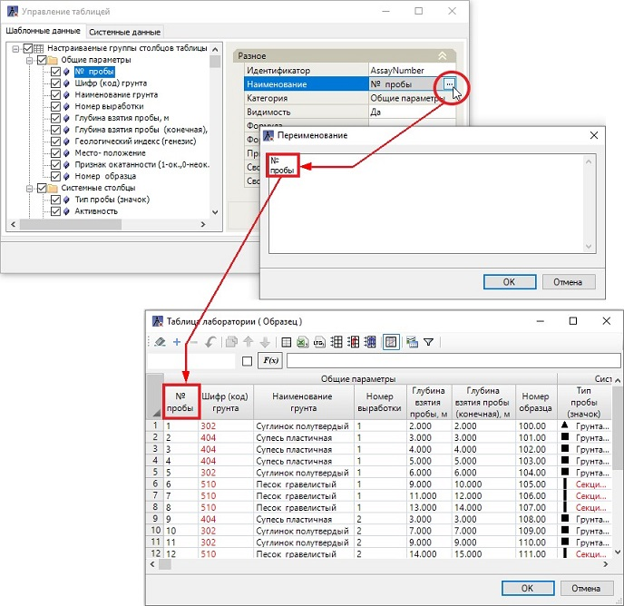

* **Категория** – в данном поле отображается, к какой общей подкатегории относится столбец (создание подкатегорий и определение порядка столбцов в них описано выше в текущем разделе).
* **Видимость** – в данном поле осуществляется управление видимостью столбцов в таблице лаборатории (аналогична опции указания видимости через «галочку» в структуре таблицы).

  

  Выключенная видимость столбца ** НЕ** исключает столбец из таблицы (шаблона). Столбец с выключенной видимостью участвует в расчетах и в него попадают импортируемые данные. Кроме того, столбцы с выключенной видимостью также экспортируются с остальными столбцами таблицы во внешние форматы, но скрытыми.

  

* **Формула** – в данном поле задается формула, например, для расчетных показателей грунтов, которая будет применяться в каждой ячейке столбца. Формулы строятся путем ссылок на идентификаторы столбцов (см. разделы [Термины и определения](terms_and_definition.md) и [Статистическая обработка результатов испытаний](statistical_processing_results_testing.md)).

  

  Так же формулу можно задать *локально* в выделенной ячейке. (см. раздел [Работа с окном Таблица лаборатории](working_window_table_laboratory.md))

  

* **Формат** – в данном поле задается числовой формат ячеек столбца, в данном поле задается числовой формат ячеек столбца, влияющий лишь на отображение числа в ячейке. Форматы между собой разделяются знаком « **;** ». Например, числовой формат ячеек **0,00;-0,0;0; «Пример»** означает что:

  * *Первая часть формата* **0,00** – для отображения положительных чисел в ячейке (в значениях будет два знака после запятой, например 5,10).
  * *Вторая часть формата* **-0,0** – для отображения отрицательных чисел в ячейке (в значениях будет один знак после запятой, например, -5,1). Если в формате убрать минус, то отрицательные числа будут отображаться без минуса (например, 5,1).
  * *Третья часть формата* – для отображения нуля (в значениях будет целое число, 0).
  * *Четвертая часть формата* – определяет вывод текста **"Пример"**. Т.е., если ввести текстовое значение в ячейке, то будет отображено *Пример*.

  

  В создаваемый числовой формат необязательно включать все части формата.

  

* **Привязка к столбцу Excel:LTG** – в данном поле задается буквенное значение столбца стороннего редактора, который будет привязан к столбцу лабораторной таблице при импорте таблицы из стороннего редактора (см. раздел [Загрузка данных лаборатории из стороннего редактора](download_data_laboratory_other_redactor.md)).
* **Сводная формула** – в данном поле задана формула для расчета сводных данных столбцов расчетной строки Нормативное значение статистической обработки (см. раздел [Статистическая обработка результатов испытаний](statistical_processing_results_testing.md)).
* **Сводный формат** – задается числовой формат ячеек расчетной строки «Нормативное значение» статистической обработки. Принцип задания формата ячеек столбца представлен в описании параметра **Формат**. (так же см. раздел [Статистическая обработка результатов испытаний](statistical_processing_results_testing.md)).

<u>*Вкладка «Системные данные»*</u>

На данной вкладке **включается/отключается** видимость **Сводных строк** статистической обработки:

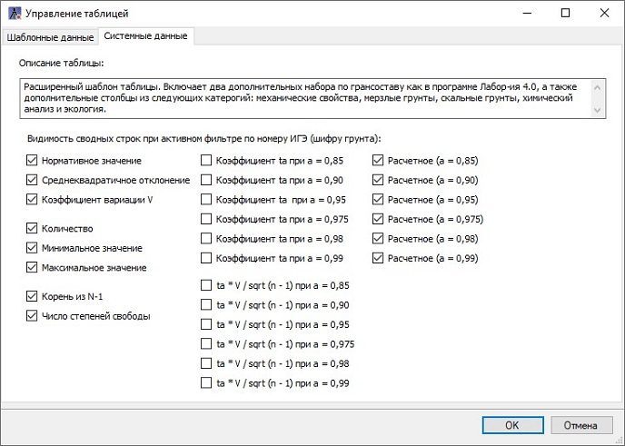

Как результат в таблице лаборатории добавятся **Сводные строки** статистической обработки.



Чтобы запустить процесс статистической обработки (увидеть сводные строки), нажмите **Фильтр по шифру грунта**  (см. раздел [Статистическая обработка результатов испытаний](statistical_processing_results_testing.md)). Если сводные строки не появились, то рядом с селектором выбора шифра грунта нажмите кнопку .  

 Также важно помнить, что расчет статистической обработки результатов испытаний производится по активным строкам столбцов таблицы (см. раздел [Статистическая обработка результатов испытаний](statistical_processing_results_testing.md)).



