# Работа с окном Таблица лаборатории

Окно Таблица лаборатории представляет собой табличный редактор, позволяющий хранить и обрабатывать внесенную информацию в табличной форме. Состоит из панели инструментов для работы с таблицей и непосредственно самой таблицы.



Здесь и далее описание функционала будет производиться на основе расширенного шаблона Extended. При использовании другого шаблона вид таблицы может отличаться.



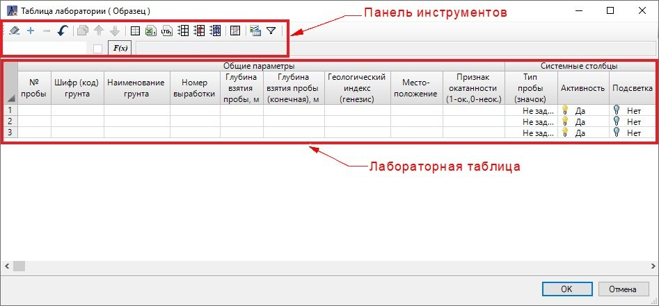



Для сохранения изменений в таблице нажмите кнопку **ОК**, данные автоматически сохранятся и окно таблицы закроется. Чтобы закрыть окно таблицы лаборатории без сохранения нажмите кнопку **Отмена**, появится запрос на подтверждения команды, нажмите **Да**:  

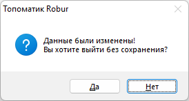



<u>*Панель инструментов*</u>:

Панель инструментов содержит в себе как стандартные функции работы с таблицей (вставить и удалить строку, копировать, очистить таблицу и т.д.) так и дополнительные функции, предназначенные для управления форматом таблицы, импорта данных, статистической обработки данных, формирование ведомостей и т.д. Так же на панели инструментов представлены: поле отображения наименования идентификатора столбца (описание термина **Идентификатор** см. раздел [Термины и определения](terms_and_definition.md)), поле для введения формул локально в выделенной ячейке (см. раздел [Статистическая обработка результатов испытаний](statistical_processing_results_testing.md)) и опция выделение/ снятие цвета текста в выбранной ячейке таблицы (см. описание ниже данного раздела).

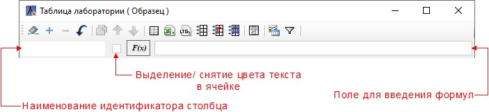

*  **Очистить таблицу** – данная функция позволяет полностью удалить все строки таблицы.
*  **Вставить строку** - добавление новой строки под последней строкой.
* 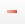 **Удалить строку** – удаление выделенной строки.
*  **Отмена** – отмена последнего действия.
*  **Копировать** – данная функция предназначена для копирования выделенной/ выделенных строки/ строк с содержащими в них данными. Копированная строка добавляется ниже исходной строки и выделяется цветом. Чтобы снять подсветку строки в ячейке столбца "Подсветка" выберите Нет (см. раздел [Статистическая обработка результатов испытаний](statistical_processing_results_testing.md)). Так же в ячейке «№ пробы» копированной строки добавляется пометка "Копия" с текстом исходной ячейки.
*  **Переместить выше/ Переместить ниже** – функции предназначены для изменения порядка выделенной строки в таблице.

  

  Функционал программы позволяет пользоваться общими инструментами при работе с таблицами. В частности, имеется возможность упорядочивать столбцы, например по порядковому номеру пробы или по наименованию грунта. Для этого ЛКМ нажмите на наименование соответствующего столбца в «шапке» таблицы:

  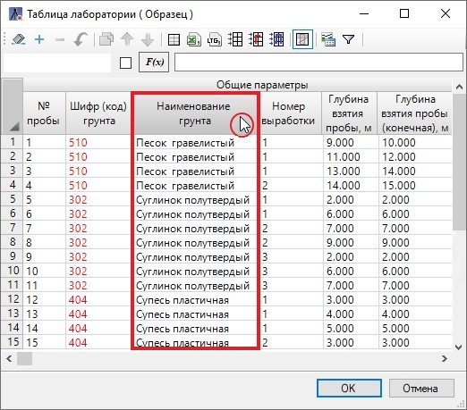

  Или чтобы одновременно заполнить ячейки столбца одними и теми же данными, выделите необходимые строки и в одной из ячеек столбца введите значение, для подтверждения команды нажмите **Enter**. Во всех выделенных строках в ячейках столбца отобразится введенный текст, красным цветом. Чтобы отключить выделение цветом текста в выделенной ячейке, на панели инструментов, рядом с функцией **F(х)**, отключите «галочку» 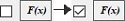:

  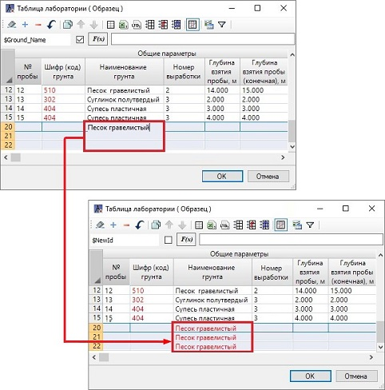

  Описание работы с таблицами в Robur и их общими функциями представлено в разделе [Работа с таблицами](../../../install_startup/startup/structure_project/work_with_tables.md)

  

*  **Управление таблицей** – данный инструмент позволяет управлять настройками таблицы лаборатории (см. раздел [Управление таблицей](table_management.md)).
*  /  **Загрузка данных из Excel/ из LTG формата** – с помощью данных функций осуществляется импорт лабораторных сведений из стороннего редактора, форматов **\*.LTG. \*.XLSX/\*.XLS**. Подробное описание смотрите в разделе [Загрузка данных лаборатории из стороннего редактора](download_data_laboratory_other_redactor.md).
*  **Импорт из общей таблицы лаборатории** – функция предназначена для импорта данных в таблицу лаборатории из **Общей таблицы лаборатории**. (см. разделы [Общие сведения о Лаборатории в Robur](laboratory_in_robur.md) и [Термины и определения](terms_and_definition.md)).  

   Для этого нажмите пиктограмму, откроется окно с наименованием общих лабораторных таблиц, выберите необходимую таблицу и нажмите **ОК**:

  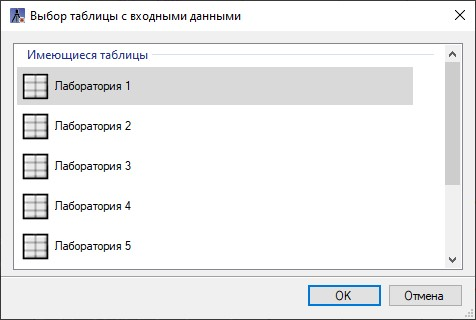

  

  При наличии в проекте нескольких моделей **Геологии**, предварительно выберите модель, в которой находится нужная **Лаборатория**:  

  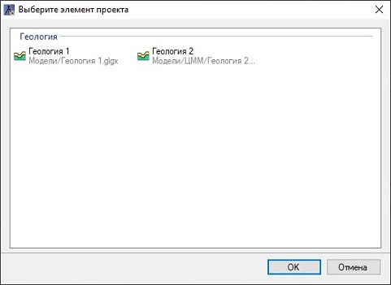

  

  Далее в открывшемся окне выберите необходимые строки для импорта и нажмите **ОК**. В результате выделенные строки с данными добавятся в текущую таблицу лаборатории:

  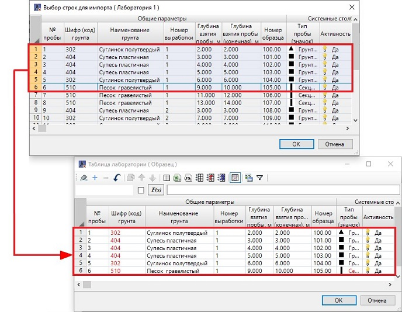

*  **Импорт из глобальной таблицы лаборатории** – для импорта данных из **Глобальной таблицы лаборатории** в **Общую** или **Локальную таблицы лаборатории** (см. разделы [Термины и определения](terms_and_definition.md) и [Распределение проб лаборатории по выработкам](distribution_samples_laboratory_by_workings.md)). Алгоритм загрузки импортируемых данных аналогичен алгоритму **Импорта из общей таблицы лаборатории**.
*  **Импорт из локальной таблицы лаборатории** – для импорта данных из **Локальной таблицы лаборатории** в **Общую** или **Глобальную таблицы лаборатории** (см. разделы [Термины и определения](terms_and_definition.md) и [Распределение проб лаборатории по выработкам](distribution_samples_laboratory_by_workings.md)). При выборе этой функции в открывшемся окне укажите необходимую модель трассы/дороги, которая содержит необходимую **Локальную таблицу лаборатории** и нажмите **ОК**:

   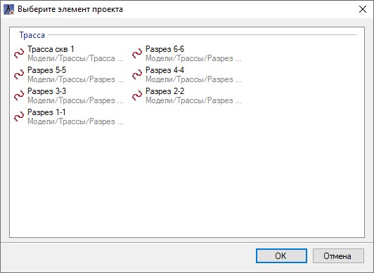

  Откроется окно выбора строк для импорта, далее алгоритм импорта аналогичен алгоритму **Импорта из общей таблицы лаборатории**.

  

  Импорт во **всех** таблицах лабораторий между собой осуществляется следующим образом:  

  1. Программа сравнивает строки (пробы) по значениям в ячейках **Ключевых столбцов** (см. раздел [Термины и определения](terms_and_definition.md)). Если эти значения в тех или иных строках не совпадают, то в конце таблицы лаборатории (в которую импортируем) добавляется строка с данными по новой пробе. Иначе, одинаковые пробы найдены (далее см. пункт 2).
  2. Программа в таблице лаборатории (в которую импортируем) проверяет наличие всех **НЕ**ключевых столбцов (наличие/совпадение Идентификаторов), которые есть в таблице лаборатории (из которой импортируем). Если какие-либо **НЕ**ключевые столбцы отсутствуют или отличаются (имеют разные Идентификаторы), то появляется предупреждение (далее см. пункт 4). Иначе (все столбцы имеются), см. пункт 3.
  3. Программа сравнивает строки (пробы) по значениям в ячейках **НЕ**ключевых столбцов. Если эти значения в тех или иных строках не совпадают, то появляется предупреждение (далее см. пункт 4). Иначе, данная строка (проба) остается неизменной (в обеих таблицах они полностью идентичны).
  4. Если появляется представленное ниже предупреждение, то это значит, что в обеих таблицах имеются одинаковые пробы, но данные по ним отличаются:

     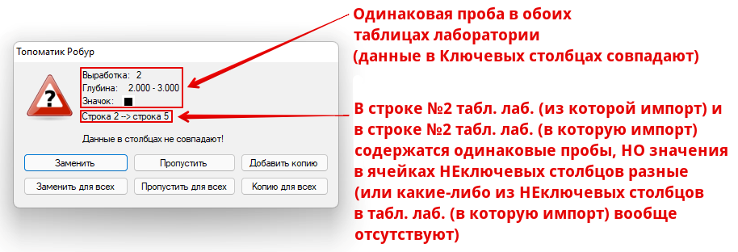

  **Заменить** – заменяет строку на строку таблицы, из которой импортируем. Если в данной строке имеются недостающие столбцы, то в таблицу (в которую импортируем) добавляются и они.

  **Заменить для всех** – то же, но для всех последующих строк с предупреждением.

  **Пропустить** – пропускает предупреждение для данной строки, т. е. данная строка в таблице (в которую импортируем) останется неизменной.

  **Пропустить для всех** – то же, но для всех последующих строк с предупреждением.

  **Добавить копию** – добавит в качестве копии строку таблицы (из которой импортируем) под исходной строкой таблицы (в которую импортируем). Копии таких строк для наглядности выделятся цветом и отметятся словом "Копия" в столбце "№ пробы" (также о работе с копиями строк см. описание выше).

  **Копию для всех** – то же, но для всех последующих строк с предупреждением.

  

*  **Скрыть / показать пустые столбцы** – функция, предназначенная для управления видимостью незаполненных столбцов таблицы.
*  **Задействованные грунты** – функция предназначена для корректного отображения данных грунтов в сводной и нормативной ведомостях. Для этого нажмите данную пиктограмму, откроется окно:

  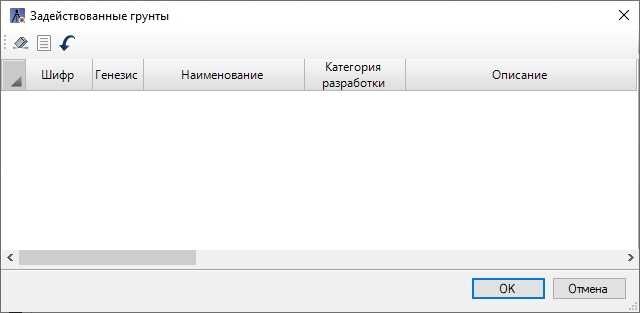

  Нажмите кнопку  (**Пересоздать**), данные грунтов отобразятся в табличной форме. Для сохранения и закрытия окна нажмите **ОК**:

  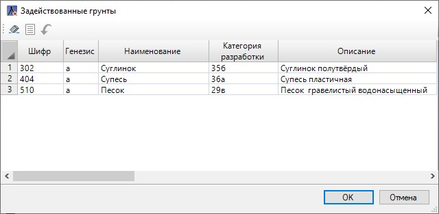

  

  Программа сопоставляет данные грунтов таблицы **Легенда грунтов** с данными грунтов таблицы лаборатории, и по совпадению шифра грунта (ИГЭ) присваивает подписи данных грунтов в выходных ведомостях.  

  При необходимости можно корректировать данные в таблице до вывода итоговой ведомости.

  

*  **Фильтр по шифру грунта** – данная функция предназначена для выделения в таблице строк с данными грунтов по шифру грунта (ИГЭ). А так же для расчета статистических данных грунтов и отображения результатов в **Расчетных строках таблицы** (см. описание раздела [Термины и определения](terms_and_definition.md)). Нажмите пиктограмму, на панели инструментов, добавится селектор с выбором шифров грунтов (ИГЭ) и дополнительная кнопка  (**Отображать сводки по столбцам**), управляющая видимостью **Сводных строк** таблицы (см. раздел [Термины и определения](terms_and_definition.md)). Описание работы с данной функцией см. раздел [Статистическая обработка результатов испытаний](statistical_processing_results_testing.md).

  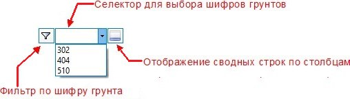  

* 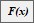 - данная функция предназначена для упрощения задания логических, математических и текстовых функций в соответствующем поле. Формулы строятся путем ссылок на идентификаторы столбцов (см. разделы [Термины и определения](terms_and_definition.md) и [Статистическая обработка результатов испытаний](statistical_processing_results_testing.md)).

*  - данная опция предназначена для выделения/ снятия цвета текста в выделенной ячейке таблицы лаборатории. Чтобы отключить выделение цветом текста, на панели инструментов, рядом с функцией F(х), отключите «галочку» .
