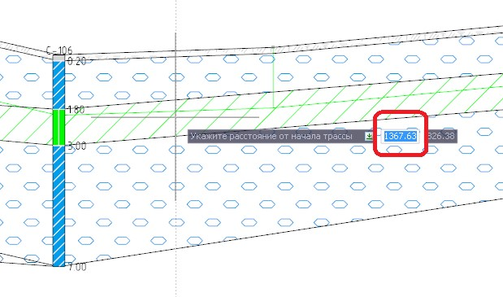
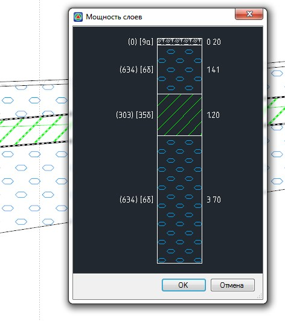

# Измерить мощность геологических слоев

Функция предназначена для измерения мощности геологических слоев.

Для этого:

1. Выберите кнопку  расположенную на панели окна **Продольный** или **Поперечный профиль**, курсор примет форму прицела.
2. Укажите положение разреза визуально или введите расстояние от начала трассы в динамической строке:

   

В результате откроется диалоговое окно с параметрами грунтов, которые попали в данный разрез:



 Имеется возможность вывести мощность только выбранных слоев, для этого, в режиме указания положения разреза, нажмите правой кнопкой мыши и выберите опцию **Указывать контур**, в следующем меню выберите **Да**. В результате при каждом указании положения места разреза необходимо будет уточнять контур геологического слоя, мощность которого необходимо вывести.


