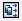
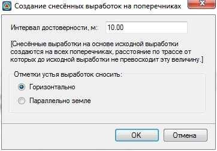
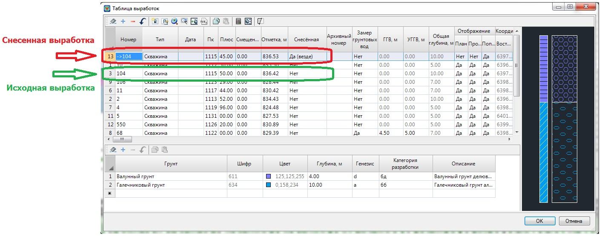

# Снесение выработок на поперечники

Функция предназначена для создания снесенных выработок на поперечные профили, задавая интервал достоверности (граница поиска) и способ вычисления отметки выработки. Функция используется в том случае когда пикеты выработок немного отличаются от пикетов поперечников, например при перенесении глобальных выработок в координатах в таблицу локальных выработок в пикетаже.

Для создания снесенных выработок:

1. В таблице **Выработок** на текущем подобъекте выделите одну или несколько выработок, которые необходимо снести на поперечники, далее нажмите кнопку  , откроется диалоговое окно:

   

 * **Интервал достоверности** – это область поиска выработок, которая строится вдоль каждого поперечника. В случае если выработка попала в интервал достоверности одного или нескольких поперечников, то создается снесенная выработка. Отметка устья снесенных выработок может быть вычислена двумя способами:

 * **Горизонтально** – отметка устья снесенной выработки будет равная отметке исходной выработки.
 * **Параллельно земле** – отметка устья снесенной выработки будет вычислена исходя из превышения отметки над линией земли исходной выработки. Т.е снесенная выработка будет расположена на том же превышении над\ под линией земли что и исходная.

2. Задайте необходимые параметры и нажмите **ОК**. В результате будут созданы выработки, у которых будет установлен флаг – **Снесенная**, а также имена которых будут частично дублировать названия исходных выработок:

   
