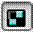
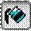
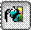

# Настройки режима отображения штриховок геологических контуров

На панели **Геология** размещены несколько кнопок позволяющих регулировать отображения штриховок контуров. К примеру, при создании очень протяженных геологических контуров, отрисовка/перерисовка штриховки может занимать определенное время и для удобства редактирования контура ее можно временно выключить или отображать сплошной заливкой.

 – данная кнопка полностью включает/выключает отображение режима штриховки или заливки всех геологических контуров.

 – данная кнопка позволяет переключаться с режима штриховки на режим заливки контуров, при условии что включено их отображение (кнопка ).

 - данная кнопка включает/выключает отображение заливки геологических выработок.
