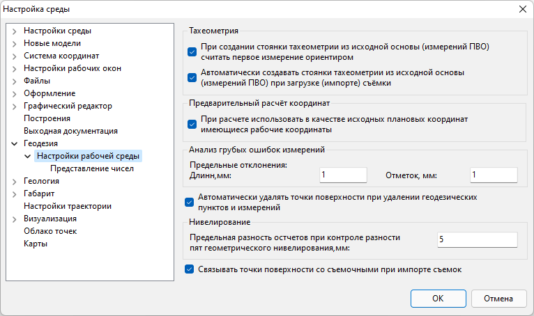

# Дополнительные настройки параметров расчета

Для изменения настроек импорта, редактирования или расчета и анализа данных геодезических измерений:

1. Выберите элемент меню **Сервис – Настройка**.
2. В появившемся окне откройте раздел **Геодезия – Настройки рабочей среды**:

   

   В поле **Тахеометрия** можно задавать следующие настройки, влияющие на расчет и редактирование данных тахеометрической съемки:

   * При создании новой тахеометрической стоянки на основе вкладки **Измерения** (кнопка Создать стоянки тахеометрии по выделенным станциям), в качестве ориентира принимается первая точка, находящаяся в таблице **Измерения** с выбранной станции.
   * При импорте измерений из файла съемки, стоянки тахеометрии на соответствующей вкладке могут быть созданы автоматически.
   * Также при удалении какого-либо геодезического пункта (например, тахеометрической станции) могут удаляться все точки, на которые с него были сделаны измерения.

3. Перейдите на вкладку **Представление чисел** для настройки единиц измерения углов и точности представления чисел:

   

4. Установите необходимые параметры расчета и нажмите **ОК**.
