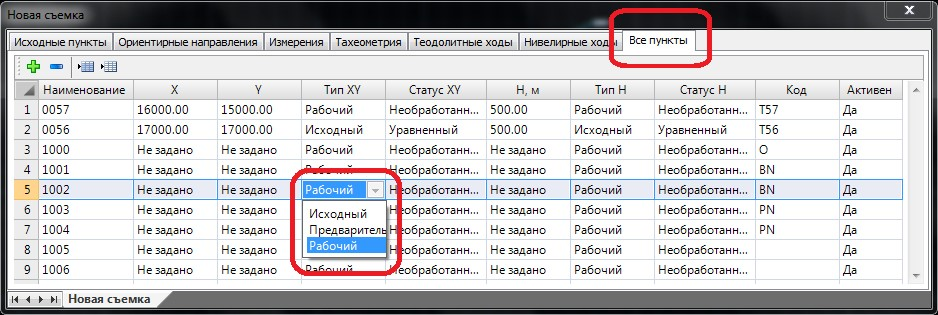

# Все пункты

В таблице **Все пункты** представлен набор всех загруженных точек съемки (как точек ПВО, так и съемочных точек тахеометрии, нивелировки и др.). Тип координат и отметок точек назначается автоматически на этапе загрузки данных в таблицу геодезического редактора, а также может быть впоследствии изменен выбором другого типа из выпадающего списка:

Параметры, назначаемые в колонках **Тип**, влияют на результаты обработки расчета съемочных данных. В столбцах **Тип ХУ** и **Тип Н** можно установить следующие типы координат и отметок точек:

* **Исходный**: данный параметр устанавливается у исходных пунктов, имеющих “жестко” заданные координаты либо отметки, которые не должны меняться в процессе расчета.
* **Предварительный**: устанавливается точкам после предварительного расчета или на этапе их загрузки. Эти координаты будут пересчитываться при дальнейших расчетах, так как они имеют неуравненные, приблизительные значения, необходимые только для предварительного просмотра точек на плане и удобства обработки съемки в нем.
* **Рабочий**: задается для точек, координаты и отметки которых должны быть рассчитаны.

Статус координат и отметок точек, в отличие от их типа, не влияет на результаты обработки и назначается им автоматически после проведения расчета (статус "полярный" также назначается в процессе загрузки съемки или создании дирекционных углов). В данных полях можно устанавливать следующие статусы координат и отметок съемочных точек:

* **Уравненный**: данный статус присваивается координатам или отметкам точек, значения которых были получены после расчета с уравниванием. Например, после расчета пунктов теодолитного хода.
* **Вычисленный**: данный статус присваивается координатам или отметкам точек, значения которых были получены после расчета без уравнивания. Например, при расчете теодолитных ходов без уравнивания (висячих ходов) или на этапе предварительного расчета.
* **Полярный**: статус задается для точек, координаты которых не могут быть рассчитаны, или для точек, являющихся ориентирами без координат – ориентирными направлениями.
* **Необработанный**: статус, назначенный координатам и отметкам точек, для которых не производился расчет.

В поле **Код** загружаются числовые или буквенные описания точек, задаваемые им в процессе съемки. В зависимости от используемого кодификатора и принятой системы кодировки точкам уже на этапе импорта в программу может присваиваться набор семантических свойств, например, их условные обозначения.



 Способы выбора и настройки используемого кодификатора более подробно описаны в разделе [Изыскательский кодификатор](../../rb_survey/dtm/codifier/settings_codifier.md).



## Активность элементов съемки

В редакторе съемки почти у всех ее элементов (пунктов, стоянок тахеометрии, нивелирных и теодолитных ходов и др.) присутствует поле «**Активный**». Оно необходимо для того, чтобы исключить этот элемент из расчетов и автоматической обработки программой без удаления его из съемки.
