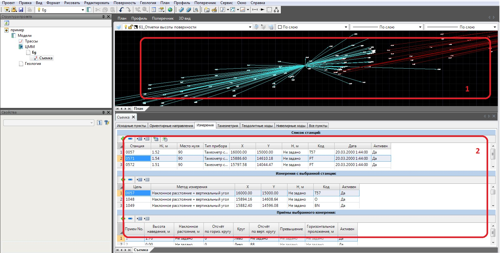

# Основные понятия

Съемка представляет собой набор геодезических пунктов и измерений, хранящихся в специальном табличном редакторе.

Окно геодезического редактора содержит группу вкладок, каждая из которых предназначена для работы с соответствующим типом данных или для решения определенных задач: обработки полигонометрии, тахеометрии, нивелирования, задания исходных пунктов и пунктов планово-высотного обоснования ПВО и др. Рассчитанные и исходные пункты отображаются на плане (окно «**План**»), с помощью линий на плане показаны измерения. Кроме того, детальные данные по расчетам можно посмотреть на соответствующих вкладках табличного редактора:

1. Графическое поле программы (окно **План**).
2. Окно геодезического редактора.

Одна **ЦММ** может содержать несколько съемок. Эти съемки могут отображаться и редактироваться одновременно.
