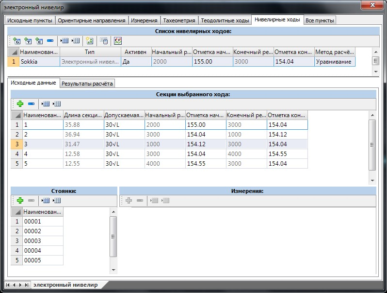
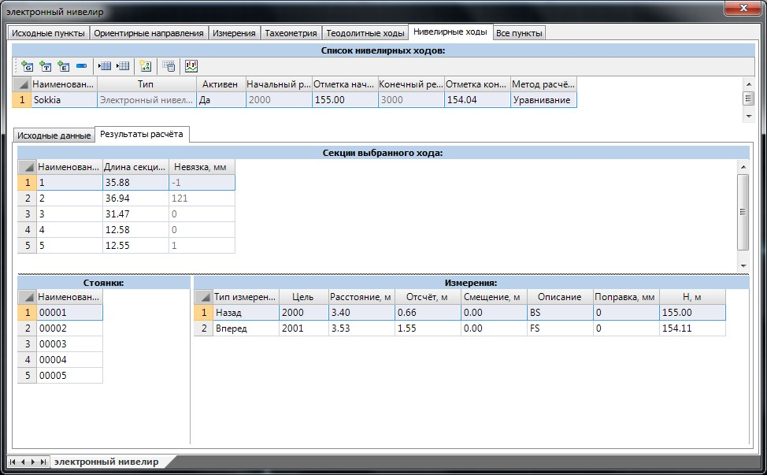

# Расчет электронного нивелирования

В отличие от геометрического нивелирования все данные измерений, необходимые для расчета хода, импортируются из файла съемки. Процедура загрузки измерений была подробно описана выше, в разделе **Импорт съемочных данных**.

Структура таблицы электронного нивелирования схожа с таблицей геометрического нивелирования:

В таблице **Секции выбранного хода** также представлен набор участков. Для каждого участка задаются следующие параметры: длина секции, формула допустимой невязки, наименование и отметки реперов. Данные измерений, загруженные из файла съемки, доступны для редактирования. Для текущей секции в таблице **Стоянки** отображается набор станций, с которых производилась съемка, а сами съемочные точки, принадлежащие выбранной станции, находятся в таблице **Измерения**.

При вводе данных нужно иметь в виду, что расстояния не являются обязательными величинами, а необходимы только при расчете невязок по формулам с поправками на дальномерный отсчет.

После того как все необходимые измерения были загружены в соответствующую таблицу геодезического редактора, можно приступить к расчету нивелирного хода. Для этого

1. Выберите его/их в таблице **Список ходов**.
2. Нажмите кнопку **Рассчитать выделенные ходы**.

В результате программа рассчитает высотную невязку, сравнит с допустимой и распределит ее по измерениям. Данные о фактической высотной невязке будут указаны в поле **Невязка** вкладки результатов расчета для каждой секции хода.

На вкладке **Результаты расчета** будут представлены таблицы с полным перечнем результатов уравнивания пунктов нивелирного хода:

