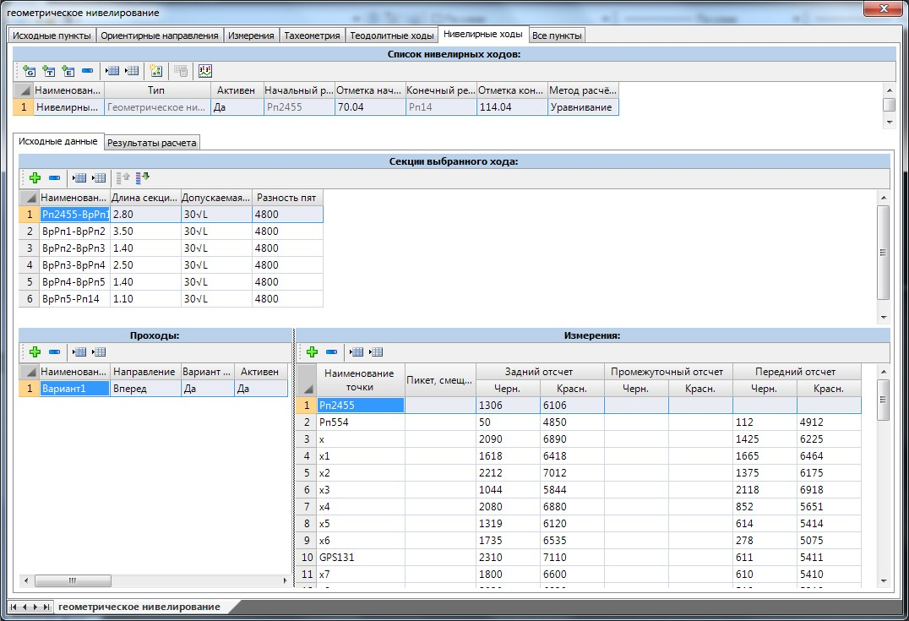
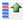
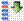
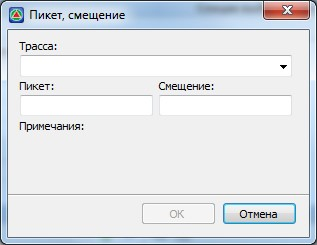
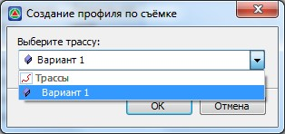
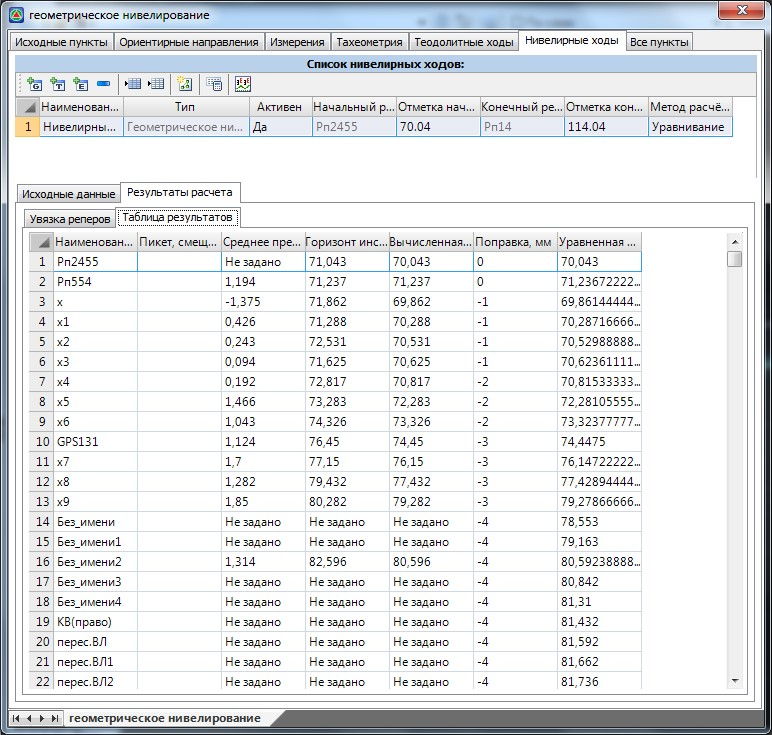
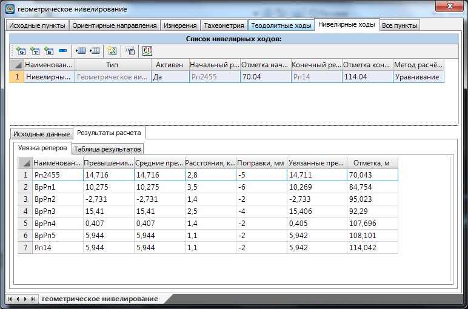

# Расчет геометрического нивелирования

После создания нивелирного хода необходимо заполнить таблицы **Секции выбранного хода**, **Проходы** и **Измерения**:

Нивелирный ход может состоять из ряда секций (участков) между реперами. Для каждой секции в соответствующих колонках вводятся такие параметры как ее длина, формула для расчета допустимой высотной невязки и разность пят между черной и красной шкалой рейки.

Если секции (участки) снимались не последовательно, то до начала расчета нивелирного хода необходимо составить их упорядоченную схему, т.е. расположить данные участки непосредственно по ходу. Для этого используются кнопки **Переместить секцию вверх**  или **Переместить секцию вниз** .

По отдельной секции съемка может проводиться в несколько приемов, задаваемых в таблицы **Проходы**. Для вновь создаваемого варианта в колонке **Направление** установлен признак **Вперед**. Если же съемка производилась по направлению, обратному к рассчитываемому нивелирному ходу, то в данной колонке необходимо установить признак **Назад**.

Если требуется, чтобы текущий вариант не участвовал в расчете превышений, то в колонке **Активность** ему необходимо выставить признак **Нет**.

В колонке **Вариант** из общего списка вариантов выбирается тот, который должен использоваться для окончательного расчета. Для этого в данной колонке ему необходимо выставить признак **Да**.

Отчеты по точкам текущего варианта задаются в таблице измерения. В соответствующих колонках данной таблицы вводятся следующие параметры:

* **Наименование точки** – наименования пунктов нивелирного хода, которые содержит текущий вариант. Если нивелирный ход содержит только одну секцию, то начальная и конечная точка этого списка являются реперами, отметки которых задаются в таблице **Список нивелирных ходов**. Если ход содержит несколько секций, то начальный и конечный пункт данного списка также являются реперами, отметки которых будут определены после процедуры увязки участков нивелирного хода (увязка реперов).
* **Задний отсчет** – в данных колонках задаются отсчеты по черной и красной шкале рейки на пункты, которые являются задними по направлению хода.
* **Передний отсчет** – в данных колонках задаются отсчеты по черной и красной шкале рейки на пункты, которые являются передними по направлению хода.
* **Промежуточный отсчет** - отсчеты по черной и красной шкале рейки на точки, снимаемые лишь с одной стоянки нивелирного хода.
* **Пикет, смещение** – при необходимости точкам нивелирного хода можно задать пикетажное положение относительно одной из трасс, которые содержит текущий проект. После расчета нивелирной съемки можно сформировать черный продольный профиль по точкам, которым была задана данная привязка.

Для того чтобы привязать точку нивелирного хода к какой-либо трассе:

1. Щелкните левой кнопкой мыши в соответствующем поле колонки **Пикет, смещение**. Появится диалоговое окно:

   
   

2. В поле **Трасса**, из выпадающего списка подобъектов, которые содержит текущий проект, выберите тот, к которому должна быть привязана данная точка нивелирной съемки.
3. В соответствующих полях данного окна задайте пикет и смещение точки хода относительно предварительно выбранной трассы. Если точка расположена слева относительно направления пикетажа трассы, то значение ее смещения вводится с отрицательным знаком.
4. Нажмите **ОК**.

В результате точке хода будет задано пикетажное положение относительно заданной трассы. Оно будет записано в колонке **Пикет, смещение**.

Для формирования профилей по точкам предварительно рассчитанных нивелирных ходов:

1. В таблице **Список нивелирных ходов** нажмите кнопку **Создать профиль по съемке**. Появится диалоговое окно:

   

   

2. В поле **Выберите трассу** из выпадающего списка выберите подобъект, для которого необходимо сформировать черный профиль по данным нивелирной съемки.
3. Нажмите кнопку **ОК**.

В результате для выбранной трассы по данным нивелирной съемки будет сформирован черный продольный профиль.

После того как все необходимые измерения заданы, можно приступить к расчету нивелирного хода. Для этого

1. Выберите его/их в таблице **Список ходов**.
2. Нажмите кнопку **Рассчитать выделенные ходы**.

В результате программа рассчитает высотную невязку, сравнит ее с допустимой и распределит ее по измерениям. Данные о фактической высотной невязке будут указаны на вкладке результатов расчета.

На вкладке **Результаты расчета** будет представлена таблица с полным перечнем уравненных пунктов нивелирного хода:

Если нивелирный ход содержал несколько секций, то в таблице **Увязка реперов** будут отражены поправочные значения, использованные для высотной увязки смежных участков хода:

