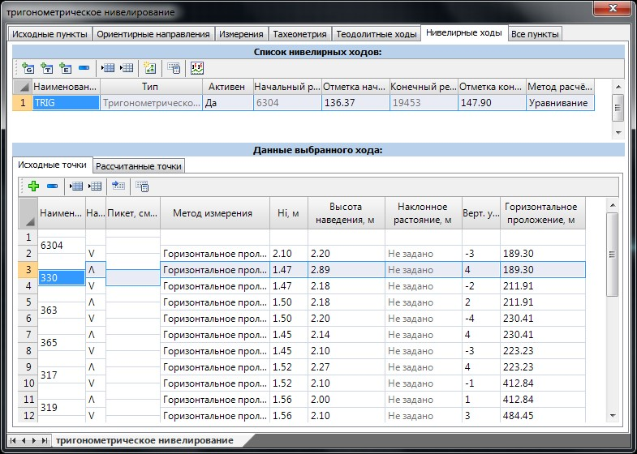
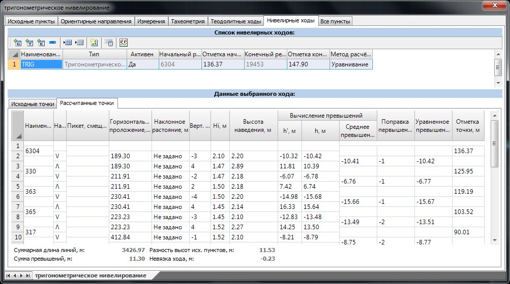

# Расчет тригонометрического нивелирования

Расчет тригонометрического хода осуществляется на основе линейно-угловых измерений, находящихся в таблице **Данные выбранного хода**:

В этой таблице в соответствующих столбцах вводятся следующие данные:

* **Наименование** – наименование пунктов тригонометрического нивелирного хода, которые содержит текущий вариант. Начальная и конечная точка этого столбца являются реперами, отметки которых задаются в таблице **Список нивелирных ходов**.
* **Направление измерения** – схематичное указание пункта, на который был произведен отсчет.
* **Пикет, смещение** - при необходимости точкам тригонометрического нивелирного хода можно задать пикетажное положение относительно одной из трасс, которые содержит текущий проект. В дальнейшем, после расчета нивелирной съемки по точкам, которым была задана данная привязка, можно сформировать черный продольный профиль. Более подробно данная последовательность действий была описана выше, в подразделе **Расчет геометрического нивелирного хода**.
* **Метод измерения** – необходимо выбрать один из способов, которым производились отсчеты на съемочные точки. Возможны следующие варианты:

  * Горизонтальное проложение + вертикальный угол.
  * Наклонное расстояние + вертикальный угол.

В зависимости от выбранного способа измерения в таблице **Приемы выбранного измерения** для ввода станут доступны соответствующие столбцы:

* **Hi** – высота инструмента прибора.
* **Высота наведения** – высота наведения на цель (высота отражателя).
* **Отсчет по вертикальному кругу, превышение, горизонтальное проложение** – в данных столбцах задаются соответствующие значения измерений. В зависимости от выбранного метода измерения один из вышеуказанных столбцов будет недоступен для ввода или редактирования.

Вышеуказанные значения отсчетов нивелирного хода могут быть заданы вручную или заполнены автоматически непосредственно из таблицы **Измерения**. Процедура автоматического создания тригонометрического хода аналогична последовательности действий по созданию теодолитного хода.

Для этого:

1. Нажмите кнопку **Создать** (проложить) тригонометрический нивелирный ход.
2. Курсор примет форму прицела. Последовательно левой кнопкой мыши укажите начальную и конечную точку хода. При наведении курсора на конечную точку хода он должен подсветиться красным цветом.
3. В строке динамического ввода задайте наименование создаваемого хода.

В результате будет создан новый тригонометрический ход с заполненной таблицей линейно-угловых измерений.



Данные тригонометрического хода заполняются на основе таблицы **Измерения**, которая была описана ранее. Автоматически ход не создастся (не выполняется п.2 вышеуказанной последовательности действий), если таблица **Измерения** не заполнена или если невозможно проложить ход между заданными точками.



При нивелирных съемках точки могут не иметь координат, и на плане их визуально нельзя будет выбрать. Однако предусмотрена функция автоматического заполнения измерений без графического ввода. Она аналогична функции создания теодолитного хода, которая была описана выше, в соответствующем подразделе.

После того как все необходимые измерения заданы, можно приступить к расчету тригонометрического нивелирного хода. Для этого:

1. Выберите его/их в таблице **Список ходов**.
2. Нажмите кнопку **Рассчитать выделенные ходы**.

В результате программа рассчитает высотную невязку, сравнит ее с допустимой и распределит по измерениям:

На вкладке **Рассчитанные точки** будет представлена таблица с полным перечнем уравненных пунктов хода. Данные о фактической высотной невязке будут указаны внизу текущей таблицы.
