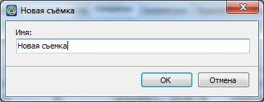
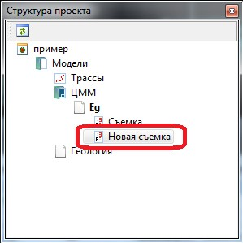

# Создание съемки

Для создания новой съемки:

1. В окне **Cтруктура проекта** щелкните правой кнопкой мыши по наименованию модели типа **ЦММ**, появится контекстное меню:

   

2. Из появившегося контекстного меню выберите пункт **Новая съемка**.
3. Введите наименование создаваемой съемки и нажмите **ОК**.

   

В результате для выбранной **ЦММ** будет создана папка Съемки, а в ней расположен сам файл созданной геодезической съемки.

