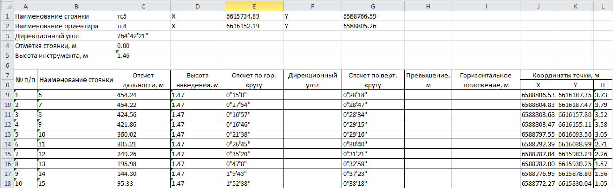

# Формирование выходных ведомостей

Программа **Топоматик Robur** позволяет формировать ведомости различных типов. Их можно разделить на следующие основные группы: результаты геодезических расчетов, результаты обработки геологических данных и ведомости разбивки трассы. Создание ведомостей, аналогично генерации чертежей, осуществляется с помощью специального мастера формирования. По результатам обработки геодезических данных могут быть сформированы:

* Ведомости тахеометрии.
* Ведомости теодолитных и нивелирных ходов различного типа.
* Ведомости координат и отметок пунктов ПВО.

Для формирования данных ведомостей:

1. Проверьте, является ли текущей **ЦММ**, содержащая съемку или группу съемок, на основе которых требуется сформировать ведомости. Процесс выбора текущей модели был описан в разделе **Структура проекта**.
2. Выберите тип создаваемой ведомости с помощью элемента меню **Проект - Создать ведомость - Съемка…**.
3. Откроется окно мастера формирования ведомостей:

   

   В данном окне, в поле **Тип ведомости** можно выбрать ее формат, в зависимости от редактора, в котором она должна быть открыта. В поле **Путь** отображается адрес папки, в которую по умолчанию сохраняются все создаваемые ведомости. Его можно изменить с помощью кнопки **Обзор**. В поле **Тип ведомости** выберите необходимый формат и нажмите кнопку **Далее**.

4. На последней странице мастера задаются специфические настройки, зависящие от типа конкретной ведомости. Например, при формировании ведомости координат тахеометрической съемки в данном окне будет представлен список ее стоянок с возможностью выбора тех, по которым требуется сформировать ведомость.

5. Задайте в мастере формирования ведомости все необходимые настройки и нажмите кнопку **Готово**.

В результате выбранная ведомость будет сформирована и в зависимости от ее формата автоматически открыта в соответствующем редакторе:

