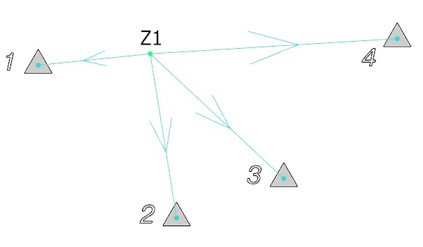

# Геодезические задачи

На вкладке **Геодезические задачи** выполняется расчет координат станций следующими способами:



Данный функционал позволяет определить координаты геодезического пункта с помощью трех (без уравнивания) или четырех (с уравниванием) измерений, которые выполнены с данного пункта и имеют известные координаты.

Для этого необходимо:

1. Наличие трех или четырех измерений (в зависимости от необходимого результата: без уравнивания или с уравниванием соответственно) с данной стоянки. Измерения должны быть **Исходными**, т.е. с известными координатами:

   

2. На вкладке **Геодезические задачи** выбрать метод расчета, нажав на панели кнопку .
3. Заполнить параметры рассчитываемой станции в разделе **Разное**, задав **Имя** и **Метод расчета** (**Угловая** или **Линейная засечка**), а также в разделе **Исходные измерения** задать список измерений, который может быть загружен из исходной основы с помощью соответствующей кнопки:

   

4. Нажать кнопку **Рассчитать**. В результате программа рассчитает координаты стоянки, записав их в соответствующие строки и отобразив произведенные расчеты в окне **План**:

   





Данный раздел находится в разработке.





Данный раздел находится в разработке.


