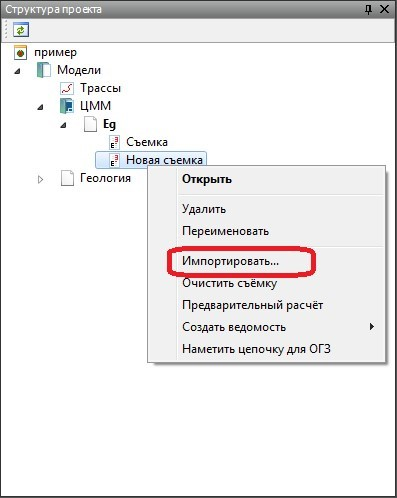
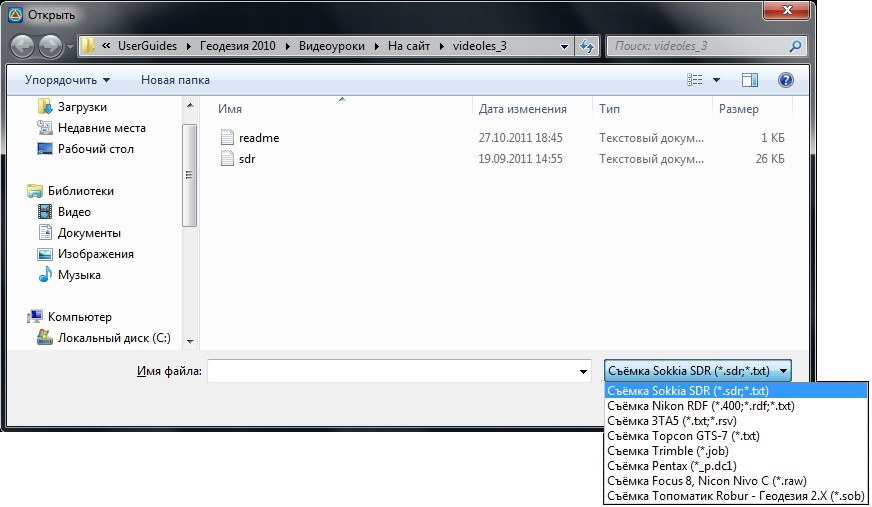
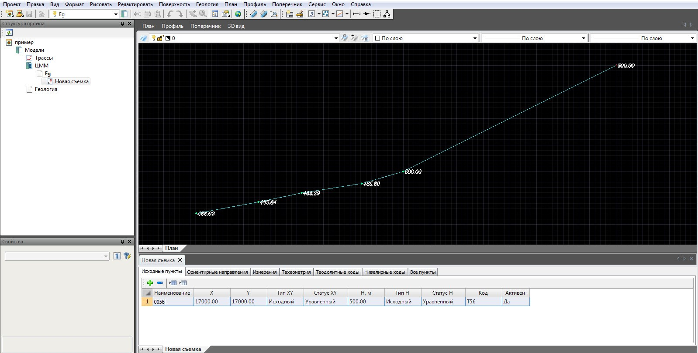

# Импорт съемочных данных

Для того чтобы загрузить данные измерений из файла съемки в геодезический редактор:

1. В окне **Структура проекта** щелкните правой кнопкой мыши по наименованию необходимой съемки, появится контекстное меню:

   

2. Из контекстного меню выберите пункт **Импортировать**.
3. В окне **Открыть** выберите папку, в которой хранится файл загружаемой съемки.
4. Укажите формат файла съемочных данных. Тип загружаемого файла выбирается из выпадающего списка окна **Открыть**.

    

5. Выберите файл со съемочными данными и нажмите кнопку **Открыть**. далее откроется диалоговое окно, в котором будет предложено выполнить **Предварительный расчет**:

   

6. Нажмите **Нет**, отклонив предварительный расчет данных после их загрузки. Все необходимые расчеты будут последовательно рассматриваться далее.

В результате программа загрузит съемочные данные в таблицу геодезического редактора и отобразит их в графическом поле программы:



 Если после импорта данных съемки в окне **План** ничего не отображается, вероятнее всего, не был произведен расчет координат точек и не были заданы координаты исходных пунктов.



Для импорта съемочных данных также можно воспользоваться элементом меню **Проект – Импортировать – Съемка**. В этом случае съемка для текущей **ЦММ** будет создана автоматически. Дальнейшая последовательность действий аналогична описанной выше (см. п.3-п.6).
